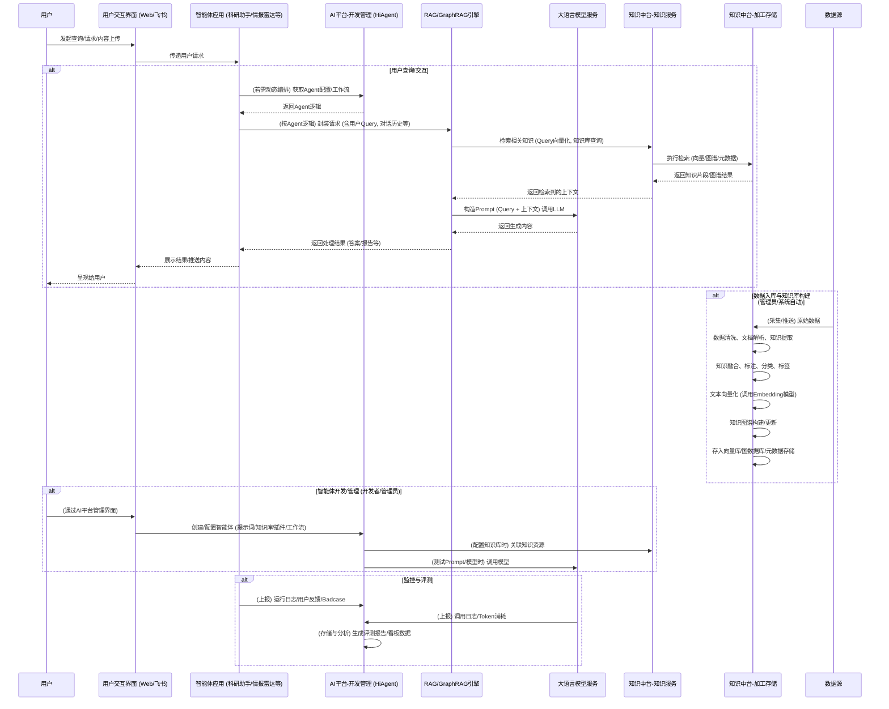

# 综合PRD文档 - 中建国际智能体研发与应用项目 V2.5

## 1. 文档信息

### 1.1 文档版本记录
| 修改时间   | 版本号 | 修改人 | 修改内容                                                                                                                               |
|------------|--------|--------|------------------------------------------------------------------------------------------------------------------------------------------------------|
| 2025-05-06 | V2.0   | Cline  | 初稿，根据新模板整合PRD V1.0及SOW文档内容                                                 |
| 2025-05-06 | V2.1   | Cline  | 参考《早期文件-中建国际AI科研项目建设方案》修订V2.0内容，补充细节并标记冲突点                       |
| 2025-05-07 | V2.3   | Cline  | 参考《[资料]2.中建国际集团智能体研发与应用立项申请书-v6.pdf》修订V2.2内容，剔除差旅助手需求，补充立项申请书中的相关规划与细节。 |
| 2025-05-07 | V2.4   | Cline  | 明确移动端交互通过中海通（飞书本地部署版本）小程序实现，强调ChatUI模式；补充完善3.5章节“场景6：暖通工程师查询设计参数”。 |
| 2025-05-08 | V2.5   | Cline  | 参考RAGFlow知识库配置文档，更新知识中台架构设计、核心功能、AI特性专项需求中关于文档分块、Embedding选型、文件上传策略、文件解析、人工干预、检索测试与调优等内容。 |
| 2025-05-08 | V2.5.1 | Cline  | 参考RAGFlow关于RAPTOR技术的文档，补充知识中台加工处理、文档分块策略及检索机制中关于RAPTOR的内容，并更新名词解释与风险评估。 |
| 2025-05-08 | V2.5.2 | Cline  | 参考RAGFlow关于知识图谱构建的文档，详细修订知识图谱构建与管理、AI特性专项需求中关于知识图谱构建的配置、流程、资源消耗及FAQ等内容，并更新名词解释与风险评估。 |
| 2025-05-08 | V2.5.3 | Cline  | 参考RAGFlow关于运行检索测试 (run_retrieval_test) 的文档，详细修订AI特性专项需求中关于检索测试的先决条件、配置参数、流程、得分计算、重要告警及FAQ等内容。 |
| 2025-05-08 | V2.5.4 | Cline  | 参考RAGFlow关于AI Chat配置 (start_chat) 的文档，新增并修订AI特性专项需求、AI平台、功能规格等章节中关于ChatUI/智能对话交互的核心配置与功能描述。 |
| 2025-05-08 | V2.5.5 | Cline  | 参考RAGFlow关于加速问答 (accelerate_question_answering) 的文档，修订AI特性专项需求、AI Chat配置等章节中关于提升问答效率的建议与耗时分析的内容。 |
| 2025-05-08 | V2.5.6 | Cline  | 参考RAGFlow关于深度研究 (implement_deep_research) 的文档，补充AI Chat/智能体关于代理推理、外部搜索集成（如Tavily API）的配置与功能描述，并更新相关章节。 |

### 1.2 名词解释与术语表
- **RAG (Retrieval Augmented Generation)**: 检索增强生成，一种结合了信息检索和文本生成技术的人工智能方法，用于提高大型语言模型回答的准确性和相关性。
- **混合搜索 (Hybrid Search)**: 一种结合了多种搜索技术（如关键词搜索和向量搜索）的检索方法，旨在利用不同技术的优势以提高检索结果的全面性和准确性。
- **智能体 (Agent)**: 能够感知环境、进行决策和执行动作的智能实体，本项目中指基于大语言模型开发的各类应用助手。
- **VeCDP (Customer Data Platform)**: 客户数据平台，SOW中提及的“客户数据平台VeCDP”下的“非结构化数据解决方案”。
- **HiAgent**: PRD V1.0及《早期文件-中建国际AI科研项目建设方案》中提及的智能体应用开发平台。
- **SSO (Single Sign-On)**: 单点登录系统。
- **POC (Proof of Concept)**: 概念验证。
- **KPI (Key Performance Indicator)**: 关键绩效指标。
- **LLM (Large Language Model)**: 大语言模型。
- **NER (Named Entity Recognition)**: 命名实体识别。
- **RBAC (Role-Based Access Control)**: 基于角色的权限控制。
- **SOW (Statement of Work)**: 工作说明书。
- **豆包大模型**: 《早期文件-中建国际AI科研项目建设方案》及《[资料]2.中建国际集团智能体研发与应用立项申请书-v6.pdf》中提及的作为技术选型基础的大语言模型。
- **火山方舟**: 《早期文件-中建国际AI科研项目建设方案》中提及的用于模型训练的平台。
- **知识中台**: 《[资料]2.中建国际集团智能体研发与应用立项申请书-v6.pdf》中提出的核心概念，用于知识的统一汇聚、存储、加工和应用。
- **AI平台**: 《[资料]2.中建国际集团智能体研发与应用立项申请书-v6.pdf》中提出的核心概念，用于快速搭建、管理和评测多种不同智能体。
- **GraphRAG**: 《[资料]2.中建国际集团智能体研发与应用立项申请书-v6.pdf》中提及的一种结合知识图谱的RAG方法。
- **分块模板 (Chunking Template)**: 针对不同类型或布局的文档，预设的用以指导文档切分过程的规则或模式，以确保切分后知识单元的语义完整性。
- **标签集 (Tag Set)**: 一个预定义的、封闭的标签集合，通常以表格形式（如XLSX, CSV, TXT）存在，包含“描述”和“标签”两列。用于通过自动标记功能为知识库中的知识单元（Chunks）赋予特定标签，以增强语义区分度和检索准确性。标签集本身不直接参与最终用户的检索过程。
- **自动标记 (Auto-tagging)**: 一种基于向量相似度的自动化过程，将标签集中的标签根据其“描述”与知识单元内容的相似度，自动应用到知识库中的相关知识单元上。旨在弥合语义鸿沟，提升特定场景下的检索效果。
- **RAPTOR (Recursive Abstractive Processing for Tree Organized Retrieval)**: 一种递归摘要处理方法，用于长上下文知识检索和摘要，通过对文档块进行递归聚类和摘要来构建层次化树结构，旨在平衡广泛的语义理解与精细的细节保留，特别适用于处理多跳问答问题。
- **LightRAG**: 一种知识图谱构建方法，旨在通过优化的提示词提取实体和关系，相较于其他方法（如GraphRAG的通用方法）消耗更少的Token、内存和计算资源。
- **实体解析 (Entity Resolution)**: 在知识图谱构建过程中，对相似的实体（如“2025年”与“2025”）进行识别和合并，以构建更有效的图谱，但会消耗更多Token。
- **社区报告 (Community Report)**: 在知识图谱中，社区是基于关系连接的实体簇。社区报告是由大语言模型为每个社区生成的摘要，有助于理解社区的主要内容，但生成过程会消耗更多Token。
- **关键词分析 (Keyword Analysis)**: 在AI助手设置中，一项可配置功能（如果平台提供），禁用后可能有助于减少获取LLM回答所需的时间。
- **深度研究 (Deep Research)**: 一种AI聊天增强功能，结合了代理推理（Agentic Reasoning）和外部知识源（如通过Tavily API进行网络搜索），使智能体能够对用户问题进行更深入的探索和分析，以提供更全面和精确的答案。
- **代理推理 (Agentic Reasoning)**: AI系统（智能体）模拟人类思考过程，能够自主规划、执行子任务、利用工具（如搜索引擎）并整合信息以达成复杂目标或回答复杂问题的能力。
- **Tavily API**: 一个提供程序化网络搜索能力的API服务，可被AI智能体用于获取实时外部信息，以支持深度研究等功能。

### 1.3 PRD目的与范围
本PRD文档旨在明确中建国际智能体研发与应用项目的各项需求、功能规格、技术方案、实施计划及验收标准。项目目标是构建一套以**AI平台**和**知识中台**为核心支撑的智能化科研辅助体系，包括科研文献管理平台（科研文献助手）、科研雷达智能体（智能情报推送服务）以及暖通领域工程助手（POC），以提升中建国际的科研效率、决策质量和知识管理水平，全面赋能中建国际数智化转型。本文档将作为项目设计、开发、测试和验收的主要依据。

## 2. 引言与概述

### 2.1 项目背景 (行业现状、企业痛点、项目必要性)
中国建筑国际作为建筑行业领军者，积累了丰富知识。但传统知识管理模式，导致知识检索与共享困难，限制了知识资产价值发挥。科研创新时，因缺乏智能知识检索工具，科研人员耗费大量时间在知识管理上，影响了创新成效。
**立项申请书指出，当前面临的主要挑战包括：**
-   **信息碎片化与滞后性**: 全球范围内的科研动态、专利技术、技术情报分散，传统人工检索和分析效率低下。
-   **宝贵经验流失**: 专家/员工离职后，其宝贵的工作经验难以得到充分利用和转化。
-   **技术竞争加剧**: 行业转型期，科研技术的实时动向需及时掌握，但现有工具对非结构化数据挖掘能力不足。
-   **科研创新效率不足**: 建筑领域科研人员面临跨学科知识整合困难，缺乏AI驱动的智能工具辅助。

**项目必要性体现在：**
-   **AI技术的成熟与应用**: 大语言模型在数据分析处理方面的强大能力，能有效提升知识管理、科研创新及业务协同效率。
-   **智能体开发工具的进步**: 低代码智能体开发平台（如HiAgent）使得快速搭建行业专属智能体应用成为可能，企业可依自身需求高效使用AI工具。
为应对这些挑战，提升科研创新能力和核心竞争力，亟需构建一个集知识管理、智能检索、智能分析和个性化服务于一体的科研辅助平台。该平台的建设对于提高科研效率、促进知识共享、辅助科研决策、加速科研成果转化具有重要意义。
正如《早期文件-中建国际AI科研项目建设方案》中所述，项目旨在“获取多源多渠道信息，挖掘治理后构建行业垂类知识库，搭建行业应用智能体，为科研成果转化提供对接场景的支持，加速科研成果落地应用，全面推动集团发展与创新做出实质性探索。”
**立项申请书进一步明确，本项目旨在构建快速搭建多种不同智能体的AI平台，并建设知识中台，协助中建国际多个需求部门的智能体搭建与评测，实现知识的高效管理，全面赋能中建国际数智化转型。**

### 2.2 产品愿景 (长期目标和价值主张)
打造一个领先的、智能化的科研创新赋能平台与知识管理中枢，成为中建国际科研人员不可或缺的智能助手，并逐步扩展至企业各业务领域。通过先进的AI技术（包括大语言模型、RAG、知识图谱等），打破知识壁垒，激活数据潜能，显著提升科研工作的效率、深度和广度，并促进业务协同，助力中建国际在行业内保持技术领先地位和创新活力。
**核心价值主张（参考立项申请书）：**
-   **提升知识管理效率**: 打造专属知识库，实现知识快检与共享，高效利用知识资产。
-   **助力科研创新**: 借助智能工具，辅助制定研发投入方向，加速科研成果转化，为科研人员提供便捷知识获取途径，提升创新效果。
-   **强化业务协同**: 通过智能体应用，提升部门协同能力，推动企业智能化升级。
-   **加速技术迭代**: AI自动化分析替代人工情报收集，减少信息处理时间，降低研发成本。
最终目标是“借助AI能力驱动科研任务提效，积累科研数据反哺AI能力提升”，未来期望实现“‘AI数据集’叠加‘AI科学家’，打造科研新范式；运用大模型挖掘科研见解结合实验迭代优化，促进科研新质生产力发展。” (源自《早期文件-中建国际AI科研项目建设方案》)
**立项申请书强调，应用大模型开发科研服务平台，建设企业智慧大脑，提供低代码方式构建智能体，实现多模型适配和专业的Agent服务。**

### 2.3 产品目标 (SMART原则：具体、可衡量、可实现、相关、时限性)
**总体目标（参考立项申请书）：构建快速搭建多种不同智能体的AI平台，并建设知识中台，协助中建国际多个需求部门的智能体搭建与评测，实现知识的高效管理，全面赋能中建国际数智化转型。**

- **具体 (Specific)**:
    1.  **搭建AI平台**: 支持快速根据场景搭建和管理多种不同智能体的平台，包含智能体运维管理能力。
    2.  **搭建知识中台**: 作为支撑体系，夯实知识管理与共享基础，通过多源数据采集与整合，构建中建国际专属的建筑行业科技知识库。
    3.  **搭建智能体应用 (试点)**:
        *   构建一个科研文献管理平台（科研文献助手/文献挖掘智能体），集成多源文献数据，实现智能化知识库构建、智能搜索与知识问答。
        *   开发一个科研雷达智能体应用（智能情报推送服务），实现用户画像构建、技术动态与研报（含专利分析）自动生成及个性化推送。
        *   完成一个暖通领域工程助手的可行性分析和POC验证。
- **可衡量 (Measurable)**:
    -  科研文献智能体对测试用例集合的上下文精确度和召回率均达到60%-75%以上（具体指标见15.1）。
    -  科研雷达智能体对测试用例集合的上下文精确度和召回率均达到60%-75%以上（具体指标见15.1）。
    -  相关智能体应用按时上线并通过验收（具体指标见SOW 2.3及本PRD 15.1）。
    -  AI平台和知识中台的基础能力按设计要求搭建完成并通过验证。
- **可实现 (Achievable)**:
    -  基于已有的HiAgent平台和火山/豆包大模型能力进行开发。
    -  项目团队具备相应的技术实力和资源保障。
    -  SOW中明确了产品配置和实施服务。
    -  立项申请书中已进行初步的技术可行性分析。
- **相关 (Relevant)**:
    -  直接解决PRD V1.0及立项申请书中提出的信息碎片化、知识管理效率低下、科研创新瓶颈等痛点。
    -  与中建国际提升科研效率、决策质量、推动数智化转型的战略目标高度一致。
- **时限性 (Time-bound)**:
    -  需求调研与PRD内容确认：2025年5月30日前完成。
    -  AI平台、知识中台基础能力构建及智能体应用与交互构建：2025年8月15日前完成。
    -  项目试运行：2025年8月18日至2025年8月29日。
    -  项目验收：2025年9月1日发起。
    (详细里程碑见17.2)

### 2.4 产品定位 (在企业生态中的位置和核心价值)
本产品定位为中建国际内部核心的**AI能力赋能平台**和**企业级知识中台**。它不仅服务于科研领域，更旨在逐步赋能企业各业务环节。它将作为连接现有内部系统数据、外部信息资源与各级员工的桥梁，通过统一的AI平台和知识中台，实现知识的高效汇聚、智能处理、便捷应用和安全共享，辅助科研创新和业务决策，是企业数字化转型和智能化升级的关键基础设施。其核心价值在于：提升科研与工作效率、促进知识共享与创新、增强业务洞察力、辅助科学决策、夯实企业数智化基础。

### 2.5 产品范围 (本次迭代包含及不包含的功能)
**包含的功能:**
1.  **AI平台建设 (基于HiAgent)**:
    -   智能体开发与管理能力（如提示词工程、插件管理、工作流编排）。
    -   多模型适配与管理能力（如接入豆包大模型、DeepSeek、智谱等）。
    -   智能体资产市场（企业通用智能体样板间、各空间智能体）。
    -   评测运营能力（模型评测、智能体评测、用量监控、日志看板）。
    -   大模型安全基础能力（如安全评测、可选防火墙集成准备）。
2.  **知识中台建设**:
    -   多源知识汇聚与接入（内部系统数据、外部文献数据如智慧芽/知网等SOW指定信源、互联网公开信息）。
    -   知识加工与处理（文档解析、清洗、结构化、向量化、知识图谱初步构建、知识分类与标签）。
    -   知识存储与管理（向量数据库、关系型数据库、知识图谱数据库、个人/部门/公司知识库权限管理雏形）。
    -   知识服务接口（检索服务、推荐服务基础）。
3.  **智能体应用试点**:
    -   **科研文献管理平台及文献挖掘智能体应用 (科研助手)**:
        *   基于知识中台的智能化知识库构建。
        *   智能搜索与知识问答（自然语言查询、多轮对话、RAG/GraphRAG检索增强架构，支持原文链接追溯）。
        *   文献关键信息提取、摘要生成。
    -   **科研雷达智能体应用 (智能情报推送服务)**:
        *   用户画像构建与更新（基于SSO系统 + 行为数据分析，初期核心管理层）。
        *   内容自动生成（每日技术动态简报、主题研报含趋势分析与预判、专利分析辅助）。
        *   个性化内容分发、推送与订阅机制（通过飞书应用精准分发）。
        *   分析与反馈机制。
    -   **暖通领域的工程助手**:
        *   进行可行性分析及对应的POC（概念验证）交付。具体POC范围在项目启动后确定。若未能确定场景及范围，则预留不超过15%工作量的方式继续合同流程。
4.  **客户数据平台VeCDP - 非结构化数据解决方案**:
    -   云上服务，有效期一年，提供产品License (作为知识处理和存储层的一部分技术支撑)。

**不包含的功能 (潜在后续迭代考虑):**
-   详细的BIM集成。
-   移动端原生应用开发（本次迭代通过中海通（飞书本地部署版本）内小程序以ChatUI模式实现移动端交互）。
-   超出SOW约定范围的信源接入或定制化功能。
-   暖通领域工程助手POC范围之外的全面功能开发。
-   立项申请书中提及的“智慧能源智能体”等其他具体业务智能体。
-   《早期文件-中建国际AI科研项目建设方案》及立项申请书中提及的更远期目标：如基于积累数据进行行业大模型深度精调与持续预训练、复杂的“AI科学家”式应用、双曲空间因果推理等高级AI能力。
-   完善的、全企业范围的知识图谱深度应用和多跳复杂推理。
-   全面的、自动化的模型微调与训练闭环。

### 2.6 核心功能概述 (简要介绍主要功能模块)
1.  **AI平台**: 提供智能体快速构建、部署、管理、监控和优化的统一平台能力。
2.  **知识中台**: 实现企业内外部知识的统一汇聚、加工、存储、管理和智能服务。
3.  **科研文献助手 (文献挖掘智能体)**: 基于知识中台，提供文献数据的统一管理、智能处理、高效检索和智能问答服务。
4.  **科研雷达智能体 (智能情报推送)**: 主动为用户提供个性化的技术动态、行业趋势、专利分析和研究报告。
5.  **暖通工程助手 (POC)**: 探索和验证在暖通工程领域利用智能体辅助特定任务的可行性。

### 2.7 成功指标 (关键绩效指标KPI，初步目标值)
主要成功指标参考SOW 2.3及本PRD 15.1节的验收指标，包括：
-   Context Precision (上下文精确度): 高于60%-75%
-   Context Recall (上下文召回率): 高于60%-75%
-   Faithfulness (回答忠实度): 高于70%-80%
-   Response Relevancy (回答相关性): 高于70%-85%
-   Noise Sensitivity (噪声敏感度): 低于10%-15%
-   Factual Correctness (回答准确性): 高于60%-75%
-   科研文献智能体对测试用例集合的召回率超过60% (试运行目标)
-   科研雷达智能体对测试用例集合的召回率超过60% (试运行目标)
-   AI平台和知识中台按设计要求完成基础能力搭建并通过验证。
-   项目按时交付并通过验收。
(详细定义和目标值见第15章)

## 3. 市场与用户分析

### 3.1 市场现状分析 (行业趋势、市场规模)
（待补充，需结合行业报告和具体市场调研数据）
当前，建筑工程及相关科研领域对于知识管理和智能辅助工具的需求日益增长。AI技术，特别是大语言模型、RAG和知识图谱的应用，为解决传统知识管理难题（如信息过载、检索效率低下、知识孤岛）提供了新的途径。市场趋势表明，企业级知识管理平台和行业专用智能体正成为提升企业核心竞争力的关键。立项申请书指出，大语言模型已广泛应用于建筑行业的设计、施工管理、运维等阶段，但全行业暂无充分利用挖掘科技成果的智能体。

### 3.2 竞品分析 (主要竞争对手、优势劣势、机会点)
（待补充，需进行详细的竞品调研）
潜在竞争对手可能包括：
-   通用型企业知识管理软件（如Confluence等，但缺乏行业深度和AI智能）。
-   专业的文献数据库和分析工具（如智慧芽、知网等，但可能缺乏企业内部知识整合和定制化智能体）。立项申请书提及“智慧芽知识产权管理系统”作为参考。
-   其他AI创业公司提供的行业解决方案或AI开发平台。
本项目的机会点在于深度结合中建国际的业务需求和内部数据，构建统一的AI平台和知识中台，提供高度定制化和智能化的解决方案，并形成企业自身的AI能力和知识资产。

### 3.3 目标用户群体

#### 3.3.1 用户画像 (User Personas，例如：科研人员、项目经理、技术专家、管理层、新员工、现场工程师、行政人员等)
-   **李明 (科研人员)**: 30岁，博士，专注于新材料研究。痛点：查找和筛选相关文献耗时，难以快速把握最新研究进展和跨领域知识。需求：高效的文献检索、智能分析工具、个性化前沿动态推送。
-   **王芳 (项目经理)**: 45岁，负责多个大型工程项目。痛点：快速获取类似项目经验、技术规范和解决方案困难。需求：便捷的项目案例库、专家知识问答、风险预警。
-   **张伟 (技术专家/暖通工程师)**: 50岁，资深暖通领域专家。痛点：需要快速查阅大量标准规范、历史数据进行方案设计和问题排查。需求：专业的知识库、智能化的工程计算辅助、方案推荐。
-   **刘敏 (管理层)**: 50岁，部门主管。痛点：希望快速了解团队科研进展、行业技术趋势、专利动态，以便做出战略决策。需求：定制化的研究报告、关键成果概览、团队知识地图、专利分析辅助。
-   **陈新 (新员工)**: 23岁，刚入职。痛点：对公司业务、技术规范、历史项目不熟悉，上手慢。需求：结构化的知识引导、快速问答系统、导师式辅导。
-   **赵工 (智能体搭建工程师/IT相关人员)**: (新增用户画像，源自立项申请书) 负责利用AI平台为各业务部门搭建和维护智能体。需求：易用的智能体开发工具、丰富的插件、灵活的工作流编排、便捷的模型管理和评测功能。
*(SOW中提及“科研雷达智能体应用”包含“用户画像构建与更新”功能，PRD V1.0提及基于SSO系统+行为数据分析。《早期文件-中建国际AI科研项目建设方案》建议用户画像构建初期先梳理核心管理层人员，未来引入CDP建设全员用户画像。立项申请书也提及科技管理相关人员、场景需求涉及的用户群体等。)*

#### 3.3.2 用户角色定义与职责
-   **知识消费者**: 主要使用平台的搜索、问答、报告阅读等功能获取信息。包括各级科研人员、项目管理人员、新员工、管理层等。
-   **知识贡献者**: 参与知识库内容的上传、编辑、审核、标注。包括领域专家、资深工程师等。
-   **智能体开发者/管理员**: 利用AI平台搭建、配置、管理和监控各类智能体应用。
-   **系统管理员**: 负责AI平台、知识中台的整体运维、用户管理、权限配置、系统监控和维护。
-   **决策者**: 关注宏观趋势、项目进展和成果，利用平台数据辅助决策。

### 3.4 用户需求分析

#### 3.4.1 用户痛点分析
-   **信息过载与筛选困难**: 海量文献和数据难以有效筛选和利用。
-   **知识孤岛与经验流失**: 知识分散，专家经验难以沉淀和共享。
-   **检索效率低下**: 传统关键词检索难以满足复杂查询需求，找不到或找不准。
-   **缺乏个性化服务**: 通用工具无法满足不同用户的特定信息需求。
-   **知识更新不及时**: 难以快速跟进最新的技术动态和研究进展。
-   **人机交互障碍**: 现有系统操作复杂，不够智能便捷。
-   **智能体开发与管理复杂**: 缺乏统一平台快速响应业务部门的AI应用需求。

#### 3.4.2 用户核心需求列表
1.  高效、精准的文献和内部知识检索能力（支持自然语言）。
2.  对复杂问题的智能问答和解释，答案需溯源。
3.  自动化生成研究简报、技术动态、专利分析和主题研报。
4.  个性化的信息推送和订阅服务。
5.  便捷的多源知识（内部、外部）汇聚、加工和管理（知识中台）。
6.  关键信息提取和文献摘要生成。
7.  特定工程领域的智能辅助（如暖通POC）。
8.  用户友好的交互界面和流畅的使用体验。
9.  低代码/无代码的智能体快速构建、部署和管理能力（AI平台）。
10. 统一的智能体监控、评测和优化机制。

#### 3.4.3 用户需求优先级
（待与业务方确认后细化，初步判断如下）
1.  **P0 (最高)**: AI平台基础能力搭建；知识中台核心功能（数据接入、处理、存储、检索）；科研文献管理平台的智能搜索与问答；科研雷达的个性化内容生成与推送。
2.  **P1 (较高)**: 智能体开发与管理流程完善；用户画像构建；知识图谱初步构建与应用；多源知识汇聚自动化。
3.  **P2 (中等)**: 暖通工程助手POC；详细的用户权限管理；评测运营平台功能完善。

### 3.5 用户场景分析 (Use Cases，描述用户在不同情境下如何使用产品解决问题)
-   **场景1：新员工快速学习公司规范**
    -   用户：陈新（新员工）
    -   情境：入职初期，需要快速了解公司的组织架构、业务流程、技术规范等。
    -   使用：通过智能问答系统提问“公司的项目管理流程是怎样的？”，系统基于内部知识库给出结构化解答和相关文档链接。订阅与自己岗位相关的知识更新。
-    **场景2：项目经理查找类似项目经验**
    -   用户：王芳（项目经理）
    -   情境：接到一个新的复杂项目，希望借鉴公司内类似项目的成功经验和教训。
    -   使用：在科研文献管理平台中搜索“XX类型项目的风险控制措施”，系统返回相关项目报告、技术方案和专家总结。
-   **场景3：科研人员进行文献调研与分析**
    -   用户：李明（科研人员）
    -   情境：正在进行一项新材料的研究，需要全面了解该领域的最新进展和关键技术。
    -   使用：通过平台进行多源文献检索，利用智能体辅助分析文献，生成研究摘要，并通过科研雷达订阅该主题的最新动态。
-   **场景4：投标团队准备技术方案**
    -   用户：投标团队成员
    -   情境：需要快速编写一份高质量的技术方案以参与项目投标。
    -   使用：利用知识库查找相关的技术标准、成功案例、公司优势技术等，通过智能助手辅助生成方案初稿。
-   **场景5：管理层获取行业动态与专利情报**
    -   用户：刘敏（管理层）
    -   情境：需要快速了解关注领域的技术发展趋势、市场动态及主要竞争对手的专利布局。
    -   使用：通过科研雷达订阅相关主题，每日接收动态简报和定期研报（包含专利分析），辅助决策。
-   **场景6：暖通工程师查询设计参数**
    -   用户：张伟（技术专家/暖通工程师）
    -   情境：张伟在进行暖通系统设计或现场问题排查时，经常需要快速查阅相关的国家/行业标准规范、设计手册中的参数、特定设备的性能数据，或者参考公司内部类似项目的历史设计参数。例如，他可能需要查询“办公楼夏季空调室内设计温湿度标准值”、“某品牌特定型号冷水机组的COP值”，或“查找公司近三年内医院洁净手术部的空调系统设计参数案例”。
    -   使用：
        1.  张伟打开中海通App，进入内置的“暖通工程助手”小程序。
        2.  助手展现为一个ChatUI交互界面。
        3.  张伟直接在对话框中输入他的问题，例如：“请帮我查一下《民用建筑供暖通风与空气调节设计规范》GB 50736-2012中，关于一级办公楼夏季空调室内设计温度的要求。”或者“XX品牌YY型号的空气处理机组在额定工况下的风量和冷量是多少？”
        4.  暖通工程助手（智能体）理解张伟的自然语言提问，并通过RAG技术从知识中台（其中包含了导入的标准规范库、产品样本数据库、企业历史项目案例库等）检索相关信息。
        5.  查询结果会以清晰、简洁的方式在ChatUI界面中呈现给张伟。例如，直接显示标准条文内容、设备参数表格，或相关案例的关键参数摘要。
        6.  所有答案都会附带明确的来源信息（如标准号及条文号、设备手册页码、项目案例编号），方便张伟追溯和核实。
        7.  如果张伟需要进一步提问，例如“这个标准是最新的版本吗？”或“这个设备还有其他型号的参数吗？”，他可以继续在ChatUI中提问，智能体将支持多轮对话，并根据上下文进行回答。
-   **场景7：业务部门快速搭建领域智能问答助手**
    -   用户：某业务部门IT接口人或业务骨干
    -   情境：部门内部有大量重复性咨询问题，希望快速搭建一个智能问答助手。
    -   使用：通过AI平台的低代码工具，上传部门专业文档到知识中台，配置提示词和工作流，快速生成并发布一个部门专属的智能问答Agent。

### 3.6 市场机会与挑战
**市场机会**:
-   企业对智能化转型和提升科研及业务效率的迫切需求。
-   AI技术的快速发展（LLM, RAG, Agent, Knowledge Graph）为解决传统知识管理和应用开发痛点提供了可能。
-   中建国际拥有丰富的内部数据和行业经验，为构建高质量知识库和行业智能体奠定基础。
-   通过统一的AI平台和知识中台，可以沉淀AI能力，降低AI应用门槛，赋能更多业务场景。
**挑战**:
-   高质量数据获取、整合与治理的难度（立项申请书强调数据多样性和处理难度）。
-   保证AI模型回答的准确性、可靠性和可解释性（立项申请书强调模型性能风险和智能体调优风险）。
-   用户使用习惯的培养和推广，以及对AI能力的正确预期管理。
-   数据安全和隐私保护，尤其是在多模型接入和外部知识利用时。
-   行业内缺乏成熟的、深度结合业务的同类标杆产品。
-   AI平台和知识中台的建设涉及复杂的技术集成和持续运营。

## 4. 产品架构

### 4.1 系统总体架构图 (展示各模块及相互关系)
**（基于立项申请书第9页架构图，并结合PRD V2.2已有内容进行整合与细化）**

```mermaid
graph TD
    subgraph "用户与应用层 (User & Application Layer)"
        U1[科研人员]
        U2[管理层]
        U3[业务部门用户]
        U4[智能体开发者/管理员]
        U5[系统管理员]

        subgraph "交互终端"
            WebApp[Web应用]
            ZhongHaiTongMiniApp["中海通小程序 (ChatUI模式)"]
        end

        subgraph "智能体应用 (Agent Applications)"
            App_KRM["科研文献管理平台 (科研助手)"]
            App_KR["科研雷达智能体 (情报推送)"]
            App_HVAC["暖通工程助手 (POC)"]
            App_Custom["其他定制/自建智能体"]
        end

    UI["用户交互界面 (Web/中海通小程序)"]

    U1 & U2 & U3 --> UI
    UI --> App_KRM
    UI --> App_KR
    UI --> App_HVAC
    UI --> App_Custom
    UI --> ZhongHaiTongMiniApp
        U4 --> AI_Platform_Dev
        U5 --> AI_Platform_Ops
        U5 --> Knowledge_Mid_Platform_Admin
    end

    subgraph "AI能力与服务层 (AI Capabilities & Services)"

        subgraph "AI平台 (AI Platform - 基于HiAgent)"
            direction LR
            AI_Platform_Dev["智能体开发与管理 (提示词/插件/工作流/知识库接入)"]
            AI_Platform_Asset["智能体资产市场 (模板/样板间)"]
            AI_Platform_Model["模型管控 (多模型API接入/Embedding模型)"]
            AI_Platform_Ops["评测运营平台 (模型/智能体评测/监控/日志/看板)"]
        end

        subgraph "大语言模型服务 (LLM Services)"
            LLM_Doubao[豆包大模型 PRO版]
            LLM_OpenSource["开源模型 (如DeepSeek)"]
            LLM_Commercial["其他三方商业模型 (如智谱)"]
        end

        RAG_Engine[RAG/GraphRAG引擎]
        Security_Firewall["大模型安全防火墙 (可选)"]

        App_KRM --> RAG_Engine
        App_KR --> RAG_Engine
        App_HVAC --> RAG_Engine
        App_Custom --> RAG_Engine
        RAG_Engine --> Knowledge_Mid_Platform_Service
        RAG_Engine --> LLM_Doubao
        RAG_Engine --> LLM_OpenSource
        RAG_Engine --> LLM_Commercial
        AI_Platform_Model --> LLM_Doubao
        AI_Platform_Model --> LLM_OpenSource
        AI_Platform_Model --> LLM_Commercial
        RAG_Engine --> Security_Firewall
        LLM_Doubao --> Security_Firewall
    end

    subgraph "知识中台 (Knowledge Middle Platform)"
        direction LR
        subgraph "知识服务 (Knowledge Services)"
            KS_Search["检索服务 (向量/全文/混合)"]
            KS_Recommend[推荐服务]
            KS_KG_Query[知识图谱查询]
            KS_API[知识API接口]
        end

        subgraph "知识加工与存储 (Knowledge Processing & Storage)"
            KP_Process["知识处理 (文档解析/清洗/结构化/实体识别/关系抽取/分类/标签/向量化/图谱构建)"]
            KP_Store_Vector["向量数据库 (VikingDB)"]
            KP_Store_KG["知识图谱数据库 (Neo4j)"]
            KP_Store_Meta["元数据/关系型数据库 (PostgreSQL/MySQL)"]
            KP_Store_Object["对象存储 (非结构化文本)"]
            User_Profile_DB["用户画像库"]
        end

        subgraph "知识接入与管理 (Knowledge Ingestion & Management)"
            KI_Ingest["数据接入与采集 (爬虫/API对接/用户上传)"]
            Knowledge_Mid_Platform_Admin["知识管理 (版本/权限/生命周期/质量审核)"]
        end

        Knowledge_Mid_Platform_Service --> KP_Process
        KP_Process --> KP_Store_Vector
        KP_Process --> KP_Store_KG
        KP_Process --> KP_Store_Meta
        KP_Process --> KP_Store_Object
        KI_Ingest --> KP_Process
        Knowledge_Mid_Platform_Admin --> KP_Process
        Knowledge_Mid_Platform_Admin --> KI_Ingest
        AI_Platform_Dev --> Knowledge_Mid_Platform_Service
    end

    subgraph "数据源层 (Data Sources)"
        DS_Internal_Sys[内部科研平台/业务系统数据]
        DS_Internal_Docs["内部知识资源 (文档/报告)"]
        DS_External_DB["外部文献库 (智慧芽/知网等)"]
        DS_Internet["互联网公开信息 (新闻/论文/专利)"]
        DS_User_Upload[用户上传内容]
        DS_ZhongHaiTong_KB[中海通知识库]
    end

    DS_Internal_Sys --> KI_Ingest
    DS_Internal_Docs --> KI_Ingest
    DS_External_DB --> KI_Ingest
    DS_Internet --> KI_Ingest
    DS_User_Upload --> KI_Ingest
    DS_ZhongHaiTong_KB --> KI_Ingest

    subgraph "基础设施层 (Infrastructure Layer)"
        direction LR
        Compute["计算资源 (CPU/GPU)"]
        Storage[存储资源]
        Network[网络资源]
        Security_Infra[基础安全设施]
        Containerization["容器化 (Docker/K8s)"]
        Monitoring_Logging_Base[基础监控与日志]
        Model_Training_Platform["模型训练与优化平台 (火山方舟 - 用于SFT/精调)"]
    end

    AI_Platform --> Compute & Storage & Network & Containerization
    Knowledge_Mid_Platform --> Compute & Storage & Network & Containerization
    LLM_Services --> Compute
    Model_Training_Platform --> Compute & Storage
    KP_Store_Vector --> Storage
    KP_Store_KG --> Storage
    KP_Store_Meta --> Storage
    KP_Store_Object --> Storage
    Security_Firewall --> Network & Compute

    AI_Platform_Ops --> Monitoring_Logging_Base
    Knowledge_Mid_Platform_Admin --> Monitoring_Logging_Base

    %% Connections between major components
    App_KRM -.-> AI_Platform_Dev
    App_KR -.-> AI_Platform_Dev
    App_HVAC -.-> AI_Platform_Dev
    App_Custom -.-> AI_Platform_Dev

    KP_Process --> Model_Training_Platform
    Model_Training_Platform --> LLM_Doubao
    Model_Training_Platform --> LLM_OpenSource

```

*说明: 此架构图整合了立项申请书中的AI平台、知识中台、评测运营、大模型安全等概念，并结合了PRD V2.2中RAG流程和应用层。HiAgent作为AI平台的具体实现。VeCDP非结构化数据解决方案体现在知识加工与存储层。移动端交互主要通过中海通（飞书本地部署版本）内的小程序以ChatUI模式实现。**为支持深度研究等高级功能，RAG/GraphRAG引擎或智能体应用可进一步集成外部知识服务，如通过Tavily API接入网络搜索引擎。** *

### 4.2 知识中台架构设计

#### 4.2.1 知识获取与采集模块 (接入层)
-   **多源数据接入**:
    -   **互联网知识收集**: 利用三方授权开放的API接口技术，按照建筑行业相关的关键词、主题和领域，定向抓取各类互联网上的公开信息（行业新闻、政策法规、技术文章、学术论文、项目案例、专利等）。对收集到的数据进行去重、清洗和筛选。
    -   **内部知识整合**: 梳理中建国际内部的各类知识资源（项目文档、设计图纸、施工方案、工艺流程、标准规范、经验总结、系统数据等）。建立统一的数据格式和标准，进行数字化和结构化处理。
    -   **外部数据库对接**: 支持从指定的外部文献数据库（如智慧芽、知网等，SOW规定20个以内信源）通过API等方式接入。
    -   **中海通（飞书本地部署版本）知识库接入**: 支持从企业中海通知识库同步内容，作为知识图谱化和向量化的重要数据源。需设计相应的定期或实时同步机制。
    -   **用户手动上传**: 支持用户通过界面上传本地文档。有两种主要方式：
        *   **直接上传至知识库**: 文件作为副本直接存储在该知识库的专属存储空间中。此方式下，若知识库被删除，这些文件副本也将随之删除。
        *   **上传至统一的“文件管理”模块，然后链接到目标知识库**: 文件存储在中央文件管理区，知识库中仅保存对文件的引用。推荐此方式，因为它允许一个文件被多个知识库引用，且即使某个知识库被删除，原始文件依然保留在文件管理模块中，避免数据丢失。
-   **数据同步与更新**: 实现各数据源（包括中海通知识库）的定期或实时同步和更新机制，确保知识的时效性。
-   **支持数据类型**: 支持结构化、半结构化和非结构化数据（PDF, Word, DOCX, Excel, XLSX, XLS, PPT, PPTX, 图片 (JPEG, JPG, PNG, TIF, GIF), 视频, 文本 (TXT, CSV, JSON, EML, HTML), Markdown等）。

#### 4.2.2 知识加工与处理模块 (加工层)
-   **文件解析与索引构建 (File Parsing and Indexing)**: 此过程在RAG中至关重要，主要包含两个核心步骤：
    1.  **文档分块 (Chunking)**: 基于文档的布局和选定的分块策略（见下文9.1.3），将文档切分为语义完整且大小合适的知识单元 (Chunks)。
    2.  **索引构建 (Index Building)**: 对切分后的知识单元构建嵌入索引 (Embedding Index) 以支持语义检索，并构建全文索引 (Full-text/Keyword Index) 以支持关键词检索。
    运用智能文档解析技术（如版面分析、OCR、复杂公式识别），对各类文档（包括扫描件、图片）进行内容提取，转换为可处理格式（如Markdown+JSON）。
-   **数据清洗与预处理**: 去除噪声（如页眉页脚、非必要元信息）、格式转换、内容去重、处理缺失值等。
-   **知识结构化与提取**:
    -   **元数据提取**: 自动提取标题、作者、摘要、关键词、日期等元数据。
    -   **命名实体识别 (NER)**: 识别文本中的人名、地名、组织机构名、专业术语等。
    -   **关系抽取**: 识别实体间的关系。
    -   **关键信息提取**: 提取核心观点、技术参数、实验结果等。
-   **知识融合与标注**:
    -   对来自不同源的知识进行融合，消除冲突和冗余。
    -   进行词法分析、句法分析、语义理解，对知识点进行分类标注（如按建筑材料、施工技术、专利分类等）。
    -   **知识标签体系构建**: 建立结构化的元数据描述和多维度标签体系，支持知识分类、检索、关联与管理。
-   **知识单元划分 (Chunking)**: 将长文档切分为合适的知识片段。核心原则：知识单元尽可能完备（不丢失上下文），长度适中。系统应提供多种**分块模板 (Chunking Templates)** 以适应不同类型的文档，并允许为知识库设置默认的分块方法，同时支持针对单个文件覆盖此默认设置。具体分块策略详见9.1.3。除了常规的分块策略，还可以考虑引入如**RAPTOR (Recursive Abstractive Processing for Tree Organized Retrieval)**这样的递归摘要和聚类方法，通过构建文档内容的层次化树状结构，进一步增强对长文档的理解和复杂查询（尤其是多跳问答）的处理能力，但这通常需要更多的计算资源。
-   **文本向量化 (Embedding)**: 使用高质量Embedding模型（如豆包embedding, `BAAI/bge-large-zh-v1.5`, `maidalun1020/bce-embedding-base_v1`等）将知识单元转换为向量表示。**重要提示**：一旦知识库中存在已处理的文档（chunks），其选用的Embedding模型便不能更改，除非删除所有现有chunks并重新处理，以确保知识库内向量空间的一致性。
    -   **知识图谱构建 (初步)**:
        -   **目的与定位**: 为增强多跳问答能力，知识图谱构建作为数据提取和索引构建之间的一个可选步骤，通过从现有知识单元（Chunks）中提取实体和关系，创建额外的知识图谱数据块。
        -   **核心过程**: 基于提取的实体和关系，构建领域知识图谱，将不同类型的知识和信息以图形化的方式进行关联和展示。详细配置和管理见5.1.1.9。
        -   **资源消耗**: 需要注意，构建知识图谱（尤其启用高级功能时）会显著消耗内存、计算资源和LLM Token。
-   **知识质量评估、审核与人工干预**:
    -   建立机制确保加工后知识的准确性和可靠性。
    -   **人工干预文件解析结果 (Manual Intervention with File Parsing Results)**: 为提升知识质量和检索效果，系统应支持：
        *   **可视化查看数据块 (Chunks)**: 允许用户查看文档被切分后的各个数据块及其原始内容快照。
        *   **手动编辑数据块内容**: 对于解析不准确或需要修正的数据块文本，提供编辑功能。
        *   **为数据块添加关键词**: 用户可以为特定的数据块手动添加关键词。这些关键词将有助于在包含这些词的查询中提升该数据块的检索排序（例如通过增加其关键词权重）。
        *   **即时检索测试**: 在查看和编辑数据块的界面，提供快速的检索测试功能，允许用户输入测试文本，立即验证当前配置（如分块、关键词添加）对检索结果的影响，并查看引用的来源。
    -   **知识库级别权重调整 (Page Rank)**: 支持对整个知识库设置页面排序权重（Page Rank），以在多知识库检索场景下优先展示特定知识库的内容。此权重作用于知识库级别，而非单个文件或文档。

#### 4.2.3 知识存储模块 (加工层/服务层)
-   **向量数据库 (如VikingDB)**: 存储文本内容的Embedding向量及其对应的原始文本片段，支持高效语义相似度检索。
-   **知识图谱数据库 (如Neo4j)**: 存储实体、关系和属性，支持图查询和复杂关系分析。知识图谱构建过程中产生的额外数据块（Chunks）也存储于此或兼容的文档引擎（如Elasticsearch或Infinity，具体取决于系统实现）。
-   **关系型数据库 (如PostgreSQL/MySQL)**: 存储结构化数据、元数据、用户信息、用户画像、权限配置、知识版本信息等。
-   **对象存储**: 存储原始的非结构化文档（如PDF、图片等）。
-   **知识库分级管理**: 支持个人库、部门库、公司库等多级知识库的逻辑划分与权限控制。
-   **动态更新与版本管理**: 确保知识的动态更新和版本管理，维持知识的高效运转。
-   **知识库删除影响**: 删除知识库时，其关联的存储（如在`root/.knowledgebase`下的同名文件夹）将被移除。直接上传至该知识库的文件副本会永久删除；而通过“文件管理”模块链接的文件，其原始文件仍保留在文件管理模块中，仅知识库中的引用关系被删除。

#### 4.2.4 知识服务模块 (服务层)
-   **统一检索服务**:
    -   语义检索（基于向量）。
    -   关键词检索（基于全文索引，可选）。
    -   混合检索。
    -   知识图谱查询。
-   **推荐服务**: 基于用户画像、行为数据和知识关联，提供个性化知识推荐。
-   **知识API接口**: 提供标准API，供上层智能体应用或其他业务系统调用知识中台的服务。
-   **订阅服务**: 支持用户订阅特定主题或类型的知识更新。
-   **权限管控服务**: 确保知识的安全访问和合规使用。

#### 4.2.5 知识应用与运营 (应用层/运营管理)
-   **支撑智能体应用**: 为科研助手、情报推送等智能体提供知识基础。
-   **知识应用效果评估**: 监控知识的使用情况，评估其在业务中的价值。
-   **用户反馈处理与知识优化**: 收集用户反馈，持续优化知识内容和组织方式。
-   **安全管理**: 管理知识访问权限，确保数据合规性、保密性，防范知识泄漏与误用。

### 4.3 AI平台架构设计 (参考立项申请书第8-10页, 及HiAgent能力)

#### 4.3.1 模型管控与接入
-   **多模型支持**: 支持快速接入和管理多种大语言模型，包括火山/豆包大模型、主流开源模型（如DeepSeek）、第三方商业模型（如智谱）等。
-   **Embedding模型管理**: 支持和管理与LLM配套的Embedding模型。
-   **模型推理点管理**: （若适用）管理模型的推理服务节点。
-   **模型效果评估**: 提供工具和流程对接入的模型进行基础性能和效果评估。
-   **数据集管理**: （若涉及微调）管理用于模型微调或评估的数据集。

#### 4.3.2 智能体开发与管理 (基于HiAgent)
-   **提示工程 (Prompt Engineering)**:
    -   提示词生成、优化、测试和版本管理。
    -   提示词模板库。
    -   互动式Prompt生成与评估。
-   **知识库集成与管理**:
    -   便捷对接知识中台的知识资源。
    -   支持为不同智能体配置专属或共享知识库。
    -   支持文档自定义分段与清理，多种检索方式（向量/全文/混合）的配置与测试。 (源自HiAgent描述)
    -   支持在智能体配置中启用或禁用知识图谱进行检索增强。
-   **插件与工具管理**:
    -   提供丰富的内置工具（如搜索、图表、论文检索等）。
    -   支持自定义插件/工具的开发、注册和管理，以扩展智能体能力（如调用外部API、执行特定计算等）。**这包括集成外部API作为工具，例如Tavily API用于网络搜索，以支持深度研究等高级功能。**
-   **外部服务API密钥管理**: 平台应提供安全的方式存储和管理智能体可能需要使用的外部服务API密钥（如Tavily API Key）。
-   **工作流编排 (Orchestration)**:
    -   提供可视化界面，通过拖拽方式编排复杂任务逻辑，串联不同的LLM调用、知识库检索、工具使用等步骤。
    -   支持多技能Agent的构建。
-   **智能体生命周期管理**: 从创建、开发、测试、发布到监控、迭代的全流程管理。
-   **智能体空间管理**: 支持个人、部门、专项及企业通用智能体空间，实现AI资产的隔离与共享。
-   **ChatUI/对话交互配置**: AI平台应支持为智能体（特别是驱动ChatUI的助手）配置详细的对话行为、检索逻辑及LLM调用参数，以实现灵活和高效的人机交互。具体配置项可参考9.3.6节。

#### 4.3.3 智能体资产市场
-   **企业通用智能体样板间/模板**: 提供预置的、可快速复用的智能体模板。
-   **AI资产沉淀与共享**: 支持插件、智能体等AI应用成果的沉淀、积累和在企业内的共享。

#### 4.3.4 评测运营平台
-   **模型评测**: 针对不同模型在特定任务上的表现进行对比评测。
-   **智能体评测**:
    -   基于预设的评测集对智能体的回答准确性、相关性、忠实度等进行评估。
    -   支持Debugging & Tracing，分析智能体决策路径。
    -   生成应用评测报告。
-   **全链路调用量监控**: 监控模型API调用量、Token消耗等。
-   **智能体调度日志与运行看板**:
    -   记录智能体运行日志，用户交互数据。
    -   提供数据分析看板，跟踪智能体运行情况（如消息数、互动用户、费用、会话互动、Token输出速度、用户满意度等）。 (源自HiAgent描述)
-   **Badcase管理与标注**: 支持记录、标注和分析Badcase，用于智能体调优。

#### 4.3.5 大模型安全 (集成或对接)
-   **模型安全评测服务**: 对接入模型的安全性进行评估。
-   **大模型安全防火墙 (可选)**: 集成或对接安全防火墙，进行内容安全过滤、风险识别与处置、API安全防护等。
-   **企业私有数据不出域**: 确保在与外部模型交互时，企业核心数据得到保护。

### 4.4 数据流程图 (展示数据在系统中的流向和处理过程)

### 4.5 技术栈选型概述
-   **智能体应用开发平台**: **HiAgent** (PRD V1.0, 《早期文件-中建国际AI科研项目建设方案》, 立项申请书)
    -   功能包括：提示词管理、知识库管理、工具管理、工作流管理、成员管理、模型评测、AI资产沉淀、数据分析看板、日志与标注。
-   **大语言模型**:
    -   主要: **火山/豆包大模型 PRO版** (如Doubao-pro-128k, Doubao-pro-32k) (PRD V1.0, SOW, 《早期文件-中建国际AI科研项目建设方案》, 立项申请书)
    -   辅助/备选: **开源模型 (如DeepSeek)**, **其他商业模型 (如智谱)** (立项申请书)
-   **Embedding模型**: 与LLM匹配的高质量模型 (如豆包embedding, text-embedding-ada) (《早期文件-中建国际AI科研项目建设方案》, 立项申请书)
-   **模型训练与优化平台**: **火山方舟** (用于SFT、精调等) (《早期文件-中建国际AI科研项目建设方案》)
-   **检索增强架构**: **RAG**, **GraphRAG** (PRD V1.0, 立项申请书)
-   **非结构化数据处理**: 客户数据平台VeCDP - 非结构化数据解决方案 (SOW), 及知识中台内置的文档解析与处理能力。
-   **数据存储**:
    -   向量数据库 (用于RAG, 如**VikingDB** 或HiAgent内置/推荐)
    -   知识图谱数据库 (可选但推荐, 如**Neo4j** 或其他)
    -   关系型数据库 (用于元数据、用户信息等, 如**PostgreSQL, MySQL**)
    -   对象存储 (用于原始文件)
    -   全文搜索引擎 (可选, 如Elasticsearch, 用于混合检索)
-   **用户画像**: 基于SSO系统数据 + 用户行为数据分析 (PRD V1.0)。《早期文件-中建国际AI科研项目建设方案》建议未来可引入CDP。知识中台也包含用户画像库。
-   **部署方式**: **云上私有化部署** (SOW, 《早期文件-中建国际AI科研项目建设方案》, 立项申请书)。支持国产化适配（硬件、操作系统、数据库）。 (立项申请书)
-   **推送渠道**: **中海通（飞书本地部署版本）小程序** (PRD V1.0基础上明确)
-   **前端框架**: (待定, 根据HiAgent平台特性和定制化需求选择，如Vue.js, React等)
-   **后端框架**: (待定, 主要由HiAgent平台提供，若有定制服务则选择如Spring Boot, Python/Flask/Django等)
-   **大模型安全防火墙**: (可选，用于增强内容安全和API防护，参考立项申请书)
-   **文档解析技术**: 具备版面分析、OCR、复杂公式识别能力的工具/服务。 (立项申请书)

## 5. 功能规格与核心需求

### 5.1 知识中台核心功能

#### 5.1.1 内容管理 (知识接入、加工、存储、管理)

##### 5.1.1.1 多源数据接入与内容上传:
-   支持从内部科研平台、业务系统、内部知识管理平台、外部文献数据库（智慧芽/知网等，SOW指定20个以内信源）、**飞书知识库**、互联网公开信息（通过爬虫）、用户手动上传等方式接入数据。
-   支持格式：PDF, Word (DOCX), Excel (XLSX, XLS), PPT (PPTX), 图片 (JPEG, JPG, PNG, TIF, GIF), 视频, 文本 (TXT, CSV, JSON, EML, HTML), Markdown等。 (参考立项申请书，并结合RAGFlow支持格式)
-   提供API接口供其他系统推送数据。
-   **文件上传策略**: 建议优先采用将文件上传至统一的“文件管理”模块，再将其链接到具体知识库的方式，而非直接上传至知识库。此举可避免因知识库删除导致文件副本永久丢失，并方便文件在多个知识库间的复用。

##### 5.1.1.2 文件解析、索引构建与结构化:
-   **文件解析 (Parsing)**: 此过程包括基于选定分块策略的文档内容切分（Chunking），以及为切分后的知识单元构建嵌入索引和全文关键词索引。
-   自动解析文档内容，提取文本、表格、公式等信息，支持复杂版面和扫描件。 (参考立项申请书)
-   对内容进行初步的结构化处理，进行词法、句法、语义分析。

##### 5.1.1.3 元数据自动提取与手动编辑:
-   自动提取文献的标题、作者、发表日期、关键词、摘要等元数据。
-   系统应允许用户为已上传至知识库的文件手动添加或编辑元数据。
-   这些元数据可以包含如来源URL、作者、创建日期、自定义标签等任意对下游应用有价值的附加信息。
-   **重要**: 用户添加或编辑的元数据必须遵循 **JSON 格式** (例如: `{"url": "http://example.com", "author": "张三"}`)，否则更新可能不会被正确应用。
-   在RAG流程中，这些元数据将与检索到的相关知识单元（chunks）一同传递给大语言模型，有助于模型生成更准确、信息更丰富的回答，例如，当用户提问时，模型可以基于元数据中的URL信息，在回答中引用原始文档的链接。
-   允许用户支持自定义元数据字段，以适应不同类型知识和业务场景的需求。

##### 5.1.1.4 内容组织与分类 (知识标签体系):
-   支持创建文件夹/目录进行内容组织。
-   支持为内容打标签（手动或基于AI自动推荐），实现多维度分类。
-   **利用标签集 (Tag Set) 进行自动标记 (Auto-tagging)**:
    -   系统支持创建特殊的“标签集”知识库，用于定义一组具有描述的标签（详见9.1.5）。
    -   在其他常规知识库的配置中，可以选择引用一个或多个标签集。
    -   当常规知识库的文档被解析或重新解析时，系统会根据知识单元内容与标签集描述的相似度，自动为知识单元打上相应的标签。
    -   此功能有助于对知识内容进行更细致和自动化的分类，提升特定查询场景下的检索准确性。
    -   标签集的管理（创建、更新、删除）应有清晰的流程，更新标签集后，相关知识库需重新解析文档以应用更改。
-   支持构建和管理企业统一的知识分类体系和标签体系。 (参考立项申请书)
-   支持知识点分类标注。

##### 5.1.1.5 版本控制与历史追溯: 支持知识内容版本管理，可追溯历史版本。 (参考立项申请书运营管理部分)

##### 5.1.1.6 内容审核与批准流程: (可选，根据需求配置) 支持自定义内容上传、修改的审核流程。

##### 5.1.1.7 内容生命周期管理: 支持知识内容的归档、更新、淘汰等管理。 (参考立项申请书运营管理部分)
-   **知识库删除**: 删除知识库时，直接上传至该知识库的文件副本将被永久删除。通过“文件管理”模块链接的文件，其原始文件将保留，仅引用关系被移除。

##### 5.1.1.8 知识单元划分与向量化管理: (参考4.2.2 及 9.1.3)
-   自动化执行文档分块和向量化，并管理生成的向量。
-   支持为知识库选择默认的**分块模板 (Chunking Template)**，并允许针对特定文件覆盖此默认设置，以适应不同文档类型和布局，确保语义完整性。具体模板类型见9.1.3。

##### 5.1.1.9 知识图谱构建与管理:
-   **目标与价值**: 旨在通过构建知识图谱增强对知识库内容的多跳问答能力和深层理解。知识图谱从已有的知识单元（Chunks）中提取实体和关系，形成结构化的知识网络。
-   **统一知识图谱**: 系统支持在知识库级别构建一个统一的知识图谱，该图谱可以跨越知识库内的多个文件。不同文件的知识图谱设置（如下述）可以不同，最终会合并成一个统一的图谱。
-   **前提条件**: 知识图谱的生成依赖于系统中已配置的默认聊天大语言模型（LLM）。
-   **核心配置项**:
    -   **启用知识图谱提取**: 在知识库配置中，可以开启“提取知识图谱”功能。
    -   **实体类型 (Entity Types)** (必需): 定义需要从知识库中提取的实体类别。系统可提供默认类型（如：组织、人物、事件、类别），用户应根据知识库的具体内容进行增删调整。
    -   **构建方法 (Method)**: 选择构建知识图谱所用的方法和提示词策略。
        -   **Light (轻量级方法，如LightRAG)**: (默认) 使用优化的提示词提取实体和关系，消耗相对较少的Token、内存和计算资源。
        -   **General (通用方法，如GraphRAG)**: 使用更通用的提示词（如GraphRAG项目提供的），可能提取更全面的信息，但资源消耗也更大。
    -   **实体解析 (Entity Resolution)** (可选):
        -   **功能**: 对提取到的相似实体进行合并去重（例如，“2025”与“2025年”，“IT”与“信息技术”）。
        -   **效果**: 构建更简洁、有效的知识图谱。
        -   **成本**: 启用此功能会消耗更多的LLM Token。默认为禁用。
    -   **社区报告生成 (Community Report Generation)** (可选):
        -   **功能**: 知识图谱中的“社区”是指由紧密关系连接起来的实体簇。此功能利用LLM为每个识别出的社区生成一段摘要性描述（即社区报告）。
        -   **效果**: 有助于理解各个实体簇的核心内容和主题。
        -   **成本**: 启用此功能会消耗更多的LLM Token。默认为禁用。
-   **资源消耗警告**: 用户应充分意识到，构建知识图谱，特别是启用实体解析、社区报告生成或使用通用构建方法时，会显著增加内存使用、计算负担和LLM Token的消耗。
-   **操作流程与更新机制**:
    1.  在知识库的“配置”页面，开启“提取知识图谱”开关或调整上述配置项，保存更改。这些设置将成为该知识库后续处理文件的默认图谱配置。在此之前已解析文件不受影响。
    2.  知识图谱的构建和更新**并非实时自动发生**，它会在新文件上传至该知识库并完成解析后，根据最新的配置自动触发更新。
    3.  一旦知识图谱成功生成，知识库的“配置”下会出现“知识图谱”入口，点击可查看图谱详情（如实体、关系、社区报告等的可视化或列表）。
    4.  要在问答或检索中实际使用已构建的知识图谱，需要在AI聊天助手（智能体）的配置中（如“提示词引擎”或“检索设置”标签页）明确开启“使用知识图谱”的选项。
-   **图谱的移除与存储**:
    -   要移除已生成的知识图谱，需要删除该知识库中所有与之相关的文件。尽管“知识图谱”的入口可能仍然可见，但图谱数据实际上已被清除。
    -   知识图谱创建的所有数据块（Chunks）存储在RAG系统的文档引擎中（例如Elasticsearch或Infinity，具体取决于后端实现）。
-   **适用场景**: 知识图谱特别适用于处理包含复杂实体、多重关系以及需要进行多步骤推理（多跳问答）的知识内容，例如技术手册、法律文档、研究报告或包含复杂人物关系的小说等。
-   **与RAPTOR的关系**: RAPTOR是另一种可用于增强多跳问答的技术，用户可以根据具体需求、资源限制和对两种技术特点的理解，选择使用知识图谱、RAPTOR，或两者结合（需注意总资源消耗）。

##### 5.1.1.10 知识质量管理与人工干预:
-   提供数据质量校验、评估和反馈机制。
-   **人工干预文件解析结果**: 为提升知识质量，系统应支持用户/管理员对已解析的文档进行干预：
    *   **可视化查看数据块 (Chunks)**: 用户可以查看文档被切分后的各个数据块及其原始内容。
    *   **手动编辑数据块内容**: 对解析不准确或需要修正的数据块文本，提供编辑功能。
    *   **为数据块添加关键词**: 用户可以为特定的数据块手动添加关键词，以提高其在相关查询中的检索排序。
    *   **即时检索测试**: 在查看和编辑数据块的界面，提供快速的检索测试功能，验证配置更改对检索结果的影响。

#### 5.1.2 搜索与检索服务

##### 5.1.2.1 关键词搜索: 支持传统的关键词匹配搜索，可配置权重和排序。

##### 5.1.2.2 高级搜索: 支持按文件类型、上传日期、作者、标签、自定义元数据等进行组合筛选。

##### 5.1.2.3 语义搜索与自然语言查询 (基于RAG/GraphRAG):
-   用户可以使用自然语言提问或描述需求。
-   系统通过RAG/GraphRAG架构理解用户意图，从向量库和知识图谱中检索相关知识并生成答案。

##### 5.1.2.4 搜索结果排序与过滤:
-   搜索结果可按相关度、时间、热度等排序。此外，可以引入知识库级别的页面排序权重（Page Rank）来影响来自不同知识库的文档块（Chunks）的排序优先级。
-   提供进一步的过滤选项和结果聚类。

##### 5.1.2.5 来源引用与可追溯性:
-   智能问答和信息提取的结果需明确标注信息来源（如原文链接、文档名称、段落位置），确保内容可追溯。 (源自《早期文件-中建国际AI科研项目建设方案》及立项申请书)

#### 5.1.3 知识关联与推荐服务:
-   基于用户画像、当前浏览/查询内容以及知识图谱中的关联，主动推荐相关的知识、文献、专家。
-   利用大模型的生成能力和知识推理能力，根据用户的知识需求模型和实时的业务场景，自动生成个性化的情报或知识推荐内容。 (源自《早期文件-中建国际AI科研项目建设方案》及立项申请书)

#### 5.1.4 知识API服务:
-   提供标准的API接口，供AI平台上的智能体应用或其他业务系统调用知识中台的检索、问答、推荐等服务。

### 5.2 AI平台核心功能 (基于HiAgent)

#### 5.2.1 模型管理
-   支持接入和管理多种大语言模型（豆包、开源、商业）及Embedding模型。
-   提供模型性能和效果的基础评测工具。

#### 5.2.2 智能体开发
-   **提示词工程**: 提供提示词编写、优化、测试、版本管理和模板库功能。
-   **知识库配置**: 为智能体关联知识中台的特定知识范围。这包括选择一个或多个知识库，并确保它们使用兼容的Embedding模型。AI平台应允许开发者对智能体（尤其是ChatUI）的检索逻辑进行精细调整，例如配置相似度阈值、关键词与向量检索的权重、返回知识块数量上限(Top N)、是否启用知识图谱等，详见9.3.6节。
-   **插件/工具集成**: 支持选择和配置内置工具，或开发和集成自定义工具。
-   **工作流编排**: 可视化拖拽方式设计和实现复杂的多步骤任务逻辑。
-   **LLM参数配置**: 允许开发者为智能体（特别是ChatUI）配置调用大语言模型时的具体参数，如选择特定模型、调整温度(Temperature)、Top P、存在惩罚(Presence Penalty)、频率惩罚(Frequency Penalty)等，以控制生成内容的风格和质量，详见9.3.6节。

#### 5.2.3 智能体管理
-   智能体的创建、部署、版本控制、启停管理。
-   智能体资产市场/模板库，方便复用和共享。
-   按空间（个人/部门/企业）管理智能体。

#### 5.2.4 评测与运营
-   **智能体评测**: 自动和人工评测智能体效果（准确性、相关性等）。
-   **运行监控与日志**: 实时监控智能体运行状态、API调用、Token消耗等。详细的交互日志记录。
-   **数据分析看板**: 提供用户行为、智能体性能、费用等多维度数据分析。
-   **Badcase管理**: 记录、跟踪和分析Badcase，辅助智能体迭代优化。

### 5.3 科研助手类智能体核心功能 (科研文献助手、科研雷达)

#### 5.3.1 智能问答 (基于RAG/GraphRAG，上下文感知，来源引用)
-   **科研文献挖掘智能体**: 针对文献库内容进行智能问答。
-   支持多轮对话，理解上下文。
-   答案需引用来源，保证准确性和可信度。ChatUI应默认清晰展示答案的引用来源，此功能应可配置（详见9.3.6）。
-   当现有知识库覆盖不到问题时，其回复策略（例如，是返回预设的固定文本，还是允许模型基于通用知识尝试回答）应是可配置的（详见9.3.6）。也可运用插件检索权威信源网站内容或提示用户。 (源自《早期文件-中建国际AI科研项目建设方案》)

#### 5.3.2 信息提取 (命名实体识别NER、关系提取、关键信息提取)
-   **科研文献挖掘智能体**: 从文献中自动提取关键信息（如研究方法、实验结果、核心观点、技术参数、专利信息等）。

#### 5.3.3 摘要生成 (单文档、多文档摘要)
-   **科研文献挖掘智能体**: 自动为单篇或多篇相关文献生成摘要。

#### 5.3.4 报告生成 (模板化报告、可定制报告)
-   **科研雷达智能体 (智能情报推送)**:
    -   自动生成每日/每周技术动态简报。
    -   根据特定主题（如新材料、绿色建筑、AI技术等）生成研究报告，包含趋势分析、预判、关键参与者、相关专利等。 (参考立项申请书专利分析部分)

#### 5.3.5 科研文献分析与辅助 (文献检索、筛选、分析、综述辅助)
-   **科研文献挖掘智能体**: 辅助用户进行文献的深度分析，如识别研究脉络、对比不同文献观点等。

#### 5.3.6 项目辅助决策 (基于历史数据和知识): (远期目标，本次迭代初步探索)
-   例如，基于历史项目数据和技术文献，为新项目提供风险点提示或技术选型参考。

#### 5.3.7 工程方案智能推荐 (暖通工程助手 POC):
-   **暖通工程助手 (POC)**: 针对特定场景（如设备选型、规范查询、故障排查思路等）进行方案推荐或信息查询的可行性验证。

#### 5.3.8 多轮对话与任务跟踪:
-   各智能体均需支持一定程度的多轮对话能力，以完成复杂查询或任务。
-   支持问答历史记录的保存和查询。 (源自《早期文件-中建国际AI科研项目建设方案》)

#### 5.3.9 智能情报推送 (科研雷达)
-   **信源获取及数据处理**: 依赖知识中台的数据接入和处理能力。 (源自《早期文件-中建国际AI科研项目建设方案》)
-   **用户画像构建**: 对不同业务板块人员构建用户画像（岗位、职责、关注领域、历史行为等），建立个性化知识需求模型。初期核心管理层，未来可引入CDP扩展。 (源自《早期文件-中建国际AI科研项目建设方案》)
-   **情报内容生成**: 结合用户画像和知识中台的最新信息（包括专利分析），生成个性化情报。 (参考立项申请书)
-   **情报推送机制**: 根据用户知识需求模型和实时业务场景，自动生成个性化情报推荐内容。通过中海通（飞书本地部署版本）小程序等渠道推送，支持用户订阅和设置推送规则。 (源自《早期文件-中建国际AI科研项目建设方案》)
-   **情报分析与反馈**: 跟踪推送情报的阅读情况、反馈意见和使用效果，优化算法和内容，挖掘潜在业务机会和风险。 (源自《早期文件-中建国际AI科研项目建设方案》)

### 5.4 用户权限与管理功能

#### 5.4.1 用户认证与授权 (安全登录):
-   与现有SSO系统集成，实现单点登录。

#### 5.4.2 基于角色的权限控制 (RBAC): (待细化)
-   定义不同用户角色（如系统管理员、知识库管理员、智能体开发者、普通用户等）及其在AI平台和知识中台的操作权限。
-   支持对知识内容（如个人库/部门库/公司库）和智能体应用的访问控制。 (参考立项申请书)

#### 5.4.3 内容级别的权限设置: (待明确是否为本次迭代范围，知识库分级管理已提及)

#### 5.4.4 用户组管理: (待明确是否为本次迭代范围)

### 5.5 协作与交流模块 (主要通过飞书应用实现)

#### 5.5.1 团队空间/项目空间: (待明确是否为本次迭代范围，AI平台支持智能体空间)

#### 5.5.2 在线讨论与评论: (待明确是否为本次迭代范围，可考虑对推送情报或问答结果的反馈)

#### 5.5.3 知识分享与通知:
-   **科研雷达智能体**: 通过中海通（飞书本地部署版本）小程序进行个性化内容推送和订阅，交互界面以ChatUI模式为主。
-   用户可以将检索到的有价值信息或智能体生成的内容方便地分享给同事或团队（如通过链接、中海通卡片等）。

### 5.6 系统管理模块 (AI平台与知识中台统一考虑)

#### 5.6.1 用户管理 (账户创建、角色分配): (与SSO集成，部分管理功能在平台内)

#### 5.6.2 系统配置与参数设置: (如信源管理、模型API密钥管理、AI平台参数调整、知识中台处理流程配置等)

#### 5.6.3 日志管理与审计追踪: (SOW提及系统监控, HiAgent平台支持日志与标注, 立项申请书提及日志看板)
 - 记录用户操作日志、系统运行日志、API调用日志、安全审计日志。

#### 5.6.4 数据备份与恢复: (基础要求)

#### 5.6.5 HiAgent平台管理功能: (参考4.5中HiAgent功能列表，已整合入AI平台功能)

#### 5.6.6 知识中台管理功能: 知识源管理、数据处理流程监控、知识质量监控、存储资源管理等。

### 5.7 系统集成与API接口 (与其他内部系统集成需求)
-   与内部科研平台、业务系统数据集成 (通过知识中台数据接入模块)。
-   与SSO系统集成。
-   与中海通（飞书本地部署版本）小程序集成 (用于消息推送、ChatUI交互)。
-   知识中台和AI平台应提供标准API接口，供其他内部系统调用其服务或进行更深度的集成。
-   如果需要嵌入到各相关业务系统，涉及用户界面设计、功能模块开发、系统接口设计等。 (源自《早期文件-中建国际AI科研项目建设方案》)

## 6. 用户场景与用户故事
(剔除差旅相关场景和故事，补充AI平台和知识中台相关场景)

### 6.1 典型用户场景描述 (Use Cases)
-   **场景1：新员工快速学习公司规范** (已在PRD V2.2中描述)
-   **场景2：项目经理查找类似项目经验** (已在PRD V2.2中描述)
-   **场景3：科研人员进行文献调研与分析** (已在PRD V2.2中描述)
-   **场景4：投标团队准备技术方案** (已在PRD V2.2中描述)
-   **场景5：管理层获取行业动态与专利情报** (已在PRD V2.3 3.5节更新)
-   **场景6：暖通工程师查询设计参数** (已在PRD V2.2中描述)
-   **场景7：业务部门IT人员快速搭建领域智能问答助手** (已在PRD V2.3 3.5节新增)
-   **场景8：知识管理员维护和更新公司核心知识库**
    -   用户：知识库管理员
    -   情境：公司发布了新的技术标准或总结了重要项目经验，需要纳入企业知识中台。
    -   使用：通过知识中台的管理界面，上传新文档，配置解析和处理规则，审核AI自动提取的元数据和标签，确认无误后发布到相关知识库，供全员或特定范围人员检索使用。
-   **场景9：AI平台管理员监控智能体运行状况**
    -   用户：AI平台管理员
    -   情境：需要确保所有上线的智能体稳定运行并达到预期的服务效果。
    -   使用：通过AI平台的评测运营看板，查看各智能体的调用量、用户反馈、Token消耗、响应时间等指标，对于表现不佳或出现错误的智能体，进一步查看日志进行分析和调优。

### 6.2 用户故事 (User Stories)
-   作为一名**科研人员**，我希望能够**通过自然语言快速检索多源文献并获得精准答案和相关文献推荐**，以便**提高我的研究效率和深度**。
-   作为一名**项目经理**，我希望能够**方便地查找到公司内部类似项目的经验总结和技术方案**，以便**更好地进行项目策划和风险规避**。
-   作为一名**技术管理者**，我希望能够**定期收到关于行业最新技术动态、趋势分析及专利情报的简报**，以便**及时调整团队研发方向和做出战略部署**。
-   作为一名**新员工**，我希望能够**通过智能问答系统快速了解公司的业务知识和规章制度**，以便**更快地适应工作岗位**。
-   作为一名**暖通工程师**，我希望能够**在设计过程中快速查询相关的技术规范和产品参数**，以便**提高设计质量和效率**。
-   作为一名**IT/业务部门智能体开发者**，我希望能够**使用低代码平台快速构建、测试和部署针对特定业务场景的智能体**，以便**快速响应业务需求，提升部门工作效率**。
-   作为一名**知识库管理员**，我希望能够**方便地管理和维护企业知识库，确保知识的准确性和时效性，并能监控知识的使用情况**，以便**持续优化知识资产**。
-   作为一名**AI平台运维人员**，我希望能够**全面监控所有智能体和模型的运行状态，及时发现并处理问题，并能评估其成本效益**，以便**保障平台的稳定高效运行**。

## 7. 用户界面与体验设计 (UI/UX)
(本章节内容主要基于PRD V2.2，立项申请书对此着墨不多，但强调了易用性)

### 7.1 UI设计原则 (简洁、直观、一致性、品牌契合等)
-   **简洁直观**: 界面设计避免复杂，功能易于理解和操作。
-   **用户友好**: 提供清晰的引导和反馈，降低用户学习成本。立项申请书强调大语言模型的自然语言交互特征使其易用性极强。移动端交互以ChatUI模式为主，应确保对话自然流畅，信息呈现简洁高效。
-   **一致性**: 整体风格、控件、交互方式在AI平台、知识中台管理界面及各智能体应用中（包括Web端和中海通小程序端）保持一致。
-   **高效性**: 优化操作流程，帮助用户快速完成任务。
-   **品牌契合**: 设计风格符合中建国际的企业形象。
*(SOW 2.1 需求调研及方案设计阶段交付物包含《相关智能体PRD文档》包括智能体交互设计文档。若发布终端为中海通（飞书本地部署版本）小程序，用户界面设计可以简略，重点关注ChatUI的体验。源自《早期文件-中建国际AI科研项目建设方案》)*

### 7.2 页面流程图 (主要业务流程的页面跳转关系)
（待交互设计文档提供，此处为占位，需覆盖AI平台、知识中台及智能体应用）
-   用户登录 -> 统一工作台/仪表盘 (展示常用智能体、知识库入口、最新情报、平台通知等)
-   **科研文献助手流程**: 工作台 -> 文献检索 -> 检索结果页 -> 文献详情页/智能问答交互
-   **科研雷达流程**: 工作台 -> 科研雷达设置 -> 订阅管理/报告查看/情报反馈
-   **暖通助手流程**: 工作台 -> 暖通助手交互界面
-   **知识中台管理流程**: 工作台 -> 知识中台管理入口 -> 数据源管理/知识处理监控/知识库管理/用户权限等
-   **AI平台管理流程**: 工作台 -> AI平台管理入口 -> 模型管理/智能体开发/插件管理/工作流设计/评测运营看板等

### 7.3 主要界面原型/线框图
（待交互设计文档提供，此处列出主要界面）

#### 7.3.1 统一工作台/仪表盘 (各智能体入口、知识库快捷访问、最新情报、平台通知、常用功能)

#### 7.3.2 知识检索界面 (搜索框、高级筛选条件、搜索历史、多知识库选择)

#### 7.3.3 知识详情页 (文献/文档内容展示、元数据、关联知识、版本历史、用户评论/反馈)

#### 7.3.4 智能问答/科研助手交互界面 (Web端为标准对话式界面，移动端通过中海通小程序内的ChatUI实现，均支持多轮交互、答案溯源展示)
-   ChatUI界面应清晰展示回答的引用来源。
-   (可选高级功能，参考9.3.6) 对于高级用户或管理员，可考虑提供查看当前对话扩展的系统提示词或检索/生成各阶段耗时的功能，以辅助分析和调试。

#### 7.3.5 知识中台管理界面
- 内容上传与数据源配置界面
- 知识处理流程配置与监控界面
- 知识库（向量库/图谱库/元数据）管理与浏览界面
- 知识分类与标签管理界面
- 用户与权限管理界面

#### 7.3.6 AI平台管理界面 (HiAgent)
- 模型接入与管理界面
- 智能体创建与配置界面 (Prompt编辑、知识库关联、插件选择、工作流设计)
- 智能体测试与发布界面
- 评测运营看板与日志查看界面

#### 7.3.7 用户个人中心/设置界面 (个人信息、订阅管理、偏好设置、我的知识/智能体)

### 7.4 交互设计说明 (关键交互逻辑、用户反馈机制)
（待交互设计文档提供）
-   **搜索交互**: 支持即时建议、模糊匹配、结果高亮、语义理解。
-   **问答交互**: Web端为类聊天机器人界面，中海通小程序端为ChatUI模式。均支持多轮对话，答案附带来源链接和可信度评估（可选）。ChatUI应注重交互的自然性和信息的有效传递。
-   **反馈机制**: 对用户操作给予及时反馈（如加载提示、成功/失败提示）。提供用户反馈渠道（如对答案点赞/点踩、问题报告）。
-   **AI平台操作交互**: 针对智能体开发等专业操作，提供引导和校验，降低使用门槛。可视化编排工具应直观易用。

### 7.5 视觉风格指南 (色彩、字体、图标等，可选)
（待UI设计确定）

## 8. 技术实现方案

### 8.1 技术选型理由

#### 8.1.1 前端框架: (待定，根据团队技术栈和需求选择，如Vue.js, React等)

#### 8.1.2 后端框架: (待定，HiAgent平台可能自带或推荐，定制部分可选择如Spring Boot, Python/Flask/Django等)

#### 8.1.3 数据库 (关系型、NoSQL、向量数据库、图数据库):
-   **向量数据库**: 存储文本向量，支持高效相似度检索，是RAG核心。选型需考虑性能、可扩展性、与现有技术栈兼容性 (如VikingDB，或HiAgent平台集成方案)。立项申请书强调容量弹性可伸缩、高可靠性、提取性能。
-   **关系型数据库 (如PostgreSQL, MySQL)**: 存储结构化数据，如用户信息、元数据、配置信息、知识中台管理数据、AI平台管理数据等。成熟稳定，生态完善。立项申请书提及国产化数据库GoldenDB、高斯DB、OceanBase。
-   **知识图谱数据库 (如Neo4j)**: (推荐采纳，立项申请书多次强调其价值) 用于构建和存储知识图谱，挖掘深层关系，支持GraphRAG。
-   **对象存储**: 存储原始非结构化文档。
-   **全文搜索引擎 (如Elasticsearch, OpenSearch)**: (可选) 用于支持关键词检索和混合检索。

#### 8.1.4 知识处理技术 (NLP库、文档解析工具):
-   **文档解析**: 需要支持PDF（包括扫描件）、Word、PPT等多种格式，具备版面分析、文字识别（OCR）、表格和公式提取能力。 (参考立项申请书第17页) 可考虑成熟的商用或开源方案。
-   **NLP库**: 使用大模型自带的文本处理能力，用于分词、实体识别、关系抽取、摘要、文本分类等。

#### 8.1.5 大语言模型(LLM)选择 (商业模型、开源模型、微调策略):
-   **主力模型**: **火山/豆包大模型 PRO版** (如Doubao-pro-128k, Doubao-pro-32k)。
-   **备选/补充模型**: **开源模型 (如DeepSeek)**, **其他商业模型 (如智谱)**。 (立项申请书)
-   **理由**: SOW中已指定供应商，豆包系列在中文处理和企业服务方面有优势。多模型接入可以满足不同场景需求和成本考量。
-   **训练与微调策略**:
    -   初期以**Prompt Engineering**和**RAG/GraphRAG**为主。
    -   根据Badcase和评估结果，后续可考虑使用**火山方舟**等平台进行模型**SFT (Supervised Fine-Tuning)** 或行业精调。 (立项申请书)
    -   立项申请书提及：准备大规模训练数据，采用分布式训练技术，采取多种训练策略对模型进行多轮训练和调优。

#### 8.1.6 智能体(Agent)框架:
-   **框架**: **HiAgent平台**。
-   **理由**: 公司内部或合作方提供的平台，应能简化智能体应用的开发和管理。具备提示词管理、知识库管理、工具管理、工作流管理、评测运营等功能。

#### 8.1.7 检索增强技术:
-   **RAG**: 核心检索增强方案。
-   **GraphRAG**: 结合知识图谱进行检索增强，提升答案质量和处理多跳问题的能力。 (立项申请书)
-   **混合检索**: 结合向量检索、关键词检索、图谱检索。
-   **重排(Re-ranking)**: 对检索结果进行优化排序。

#### 8.1.8 消息队列、缓存等中间件: (根据系统复杂度和性能需求酌情引入)
-   **消息队列 (如Kafka, RabbitMQ)**: 用于异步处理任务（如文档入库处理、情报生成）、解耦系统模块。
-   **缓存 (如Redis)**: 缓存热点数据、检索结果、用户会话等，提高响应速度。

#### 8.1.9 大模型安全防火墙: (可选，参考立项申请书)
-   用于安全风险问题识别和判定，基于安全大模型生成风险场景下的安全回复，七层请求攻击防护。

### 8.2 系统性能要求 (具体指标)
参考11.1节非功能性需求中的性能需求。
-   查询响应时间: 语义搜索/问答平均响应时间 < 5-8秒。
-   并发用户数: (待明确，例如支持100并发用户)。
-   数据处理能力: 能够处理TB级别的非结构化数据存储和分析 (PRD V1.0)。立项申请书提及文档处理耗时（一个PDF约20-s），需关注批量处理效率。
-   知识库索引构建/更新时间: 满足业务对知识时效性的要求。

### 8.3 安全与隐私保障方案 (数据加密、访问控制、防攻击、合规性)
参考11.4节非功能性需求中的安全性需求，并结合立项申请书第21-22页的安全架构。
-   **数据加密**: 传输过程使用HTTPS，敏感数据存储加密。
-   **访问控制**: 基于角色的权限控制（RBAC），确保用户只能访问授权数据和功能。知识库支持分级权限。
-   **企业私有数据不出域**: 严格控制敏感数据流向，尤其在调用外部模型或服务时。 (立项申请书)
-   **合规性**: 遵守国家及企业相关数据安全和隐私保护规定。
-   **大模型安全**:
    -   可选配大模型安全防火墙，进行内容审查和风险处置。
    -   对Prompt注入等攻击进行防范。
-   **原生安全架构 (参考立项申请书)**: 覆盖基础设施层（主机安全、容器安全）、数据安全底座（数据库审计、数据防泄漏DLP）、应用服务层（防火墙、API安全、防网络攻击）等多层面防护。

### 8.4 部署方案 (服务器环境、容器化、CI/CD)
-   **部署方式**: **云上私有化部署** 。
-   **国产化适配**: 支持国产化硬件（海光CPU、鲲鹏CPU）、国产化操作系统（麒麟、统信）、国产化数据库（GoldenDB、高斯DB、OceanBase）。 (立项申请书)
-   **服务器环境**: (待火山引擎方提供具体配置建议，可能包括计算、存储、数据库、向量库、图数据库、ES、公网访问、负载均衡等基础云资源，参考《早期文件-中建国际AI科研项目建设方案》项目投入部分及立项申请书)。
-   **容器化**: 推荐使用Docker、Kubernetes等容器化技术，便于部署、扩展和管理。
-   **CI/CD**: (建议) 建立持续集成/持续部署流程，提高交付效率和质量。

### 8.5 可扩展性设计
参考11.6节非功能性需求中的可扩展性需求。
-   系统架构应支持水平扩展，以应对用户量和数据量的增长。
-   AI平台、知识中台、LLM服务、数据库等关键组件应具备良好的扩展能力。
-   模块化设计，便于独立升级和扩展。

## 9. AI 特性专项需求 (RAG、GraphRAG与智能体)

### 9.1 数据源与预处理 (知识中台核心能力)

#### 9.1.1 明确数据来源 (内部文档库、外部数据库、API等)
-   内部科研平台数据、内部知识管理平台沉淀的知识（项目文档、设计图纸、施工方案、标准规范、专家经验等）。
-   外部文献数据：智慧芽、知网等，SOW指定20个以内信源。 (立项申请书提及智慧芽)
-   **中海通（飞书本地部署版本）知识库**: 企业内部在中海通平台上积累的知识文档。 (用户确认)
-   互联网公开信息：通过网络爬虫技术定向抓取（行业新闻、政策法规、技术文章、学术论文、专利等）。
-   用户上传的各类文档。

#### 9.1.2 数据清洗与格式转换
-   对原始数据进行去重、清洗和筛选，去除无关信息、处理格式错误、去除噪声（如页眉页脚、参考文献列表等可选择性去除）。 (参考立项申请书论文分段说明)
-   将不同格式的文档统一转换为可处理的文本格式（如Markdown+JSON）。
-   建立严格的数据质量评估和审核机制。 (源自《早期文件-中建国际AI科研项目建设方案》风险应对)

#### 9.1.3 文档分块(Chunking)策略
-   根据文档类型和内容特性，选择合适的分块大小和重叠策略，以平衡检索的完整性和精确性。
-   **核心原则**: 每个知识单元的知识尽可能完备（不丢失上下文信息）；每个知识单元的长度适中（如控制在LLM接受输入Token上限的1/5以内，或根据模型优化）。
-   **分块模板 (Chunking Templates)**: RAGFlow提供了多种分块模板以适应不同布局和格式的文档，确保语义完整性。知识中台应支持类似的机制，允许为知识库选择默认的分块模板，并可针对单个文件进行覆盖。支持的模板类型可参考如下：
    | **模板 (Template)** | 描述 (Description)                                                                 | 兼容文件格式 (File format)                                                                                   |
    |-------------------|------------------------------------------------------------------------------------|---------------------------------------------------------------------------------------------------------------|
    | General (通用)    | 基于预设的Token数量连续切分文件。                                                        | DOCX, XLSX, XLS (Excel97~2003), PPT, PDF, TXT, JPEG, JPG, PNG, TIF, GIF, CSV, JSON, EML, HTML |
    | Q&A (问答对)      | 适用于问答对格式的数据。                                                                 | XLSX, XLS (Excel97~2003), CSV/TXT                                                             |
    | Resume (简历)     | 针对简历文档的优化切分 (企业版特性，可参考demo.ragflow.io)。                                | DOCX, PDF, TXT                                                                                |
    | Manual (手动PDF)  | 针对PDF的手动分块优化。                                                                | PDF                                                                                           |
    | Table (表格)      | 针对表格数据的优化切分。                                                                 | XLSX, XLS (Excel97~2003), CSV/TXT                                                             |
    | Paper (论文)      | 针对论文结构的优化切分 (如按章节、摘要等)。                                                    | PDF                                                                                           |
    | Book (书籍)       | 针对书籍结构的优化切分。                                                                 | DOCX, PDF, TXT                                                                                |
    | Laws (法律条文)   | 针对法律法规文档的优化切分。                                                               | DOCX, PDF, TXT                                                                                |
    | Presentation (演示文稿) | 针对演示文稿（如PPT转PDF）的优化切分。                                                       | PDF, PPTX                                                                                     |
    | Picture (图片)    | 针对图片文件的处理。                                                                   | JPEG, JPG, PNG, TIF, GIF                                                                      |
    | One (单块)        | 将每个文档作为一个完整的块处理。                                                              | DOCX, XLSX, XLS (Excel97~2003), PDF, TXT                                                      |
    | Tag (标签集知识库专用) | 特殊的分块方法，用于创建一个作为“标签集”的知识库。此知识库本身不用于直接检索，而是定义一组标签及其描述，供其他知识库在自动标记过程中使用。 | XLSX, CSV/TXT (文件内容应包含“Description”和“Tag”两列)                                         |
-   HiAgent平台或知识中台应支持或可配置上述及其他必要的分段方法。 (参考立项申请书)
-   允许在文件级别覆盖知识库默认的分块方法，以提供更细致的控制。

-   **增强型分块与组织策略：RAPTOR (Recursive Abstractive Processing for Tree Organized Retrieval)**
    -   **基本原理**: RAPTOR 是一种先进的文档预处理技术，旨在通过递归方式对文档块(chunks)进行语义聚类，并对每个簇进行摘要，从而构建一个层次化的树状结构。这个树的叶子节点是原始的文档块，而中间节点和根节点是不同层级的摘要信息。
    -   **核心优势**:
        *   **长上下文处理**: 能够有效处理非常长的文档，通过多层次摘要捕捉广泛的语义理解和精细的细节。
        *   **多跳问答增强**: 特别适用于需要复杂、多步骤推理的多跳问答场景。RAPTOR 通过提供不同粒度的上下文（从原始细节到高度概括的摘要），帮助大语言模型更好地连接问题和答案之间的语义鸿沟。
        *   **平衡理解与细节**: 树状结构使得系统可以同时利用高层摘要进行宏观理解，并利用底层细节进行精确回答。
    -   **应用考量**:
        *   **资源消耗**: 启用 RAPTOR 需要显著的内存、计算资源和Token消耗（用于生成摘要）。在系统设计和资源规划时需要充分考虑。
        *   **适用场景**: 主要针对需要深度理解和复杂推理的长文档问答任务。对于简单问答或短文本，其优势可能不明显，且成本较高。
        *   **集成方式**: 可作为知识中台在数据提取和索引构建之间的一个可选的、增强的文档处理步骤。
    -   **配置参数 (参考RAGFlow)**: 若引入RAPTOR，可能需要配置如摘要生成所用的Prompt、每个摘要块的最大Token数、聚类阈值、最大簇数量、随机种子等参数。

#### 9.1.4 嵌入(Embedding)模型选择与生成
-   选择与所用LLM（如豆包大模型）匹配或兼容的高质量Embedding模型。可考虑本地部署的模型如：
    *   `BAAI/bge-large-zh-v1.5`
    *   `maidalun1020/bce-embedding-base_v1`
    *   其他如豆包embedding, OpenAI text-embedding-ada, 微软E5, Facebook FastText等。
-   对分块后的文本进行向量化，生成Embedding向量。嵌入式向量能够表示文本内容的语义关系。
-   **重要**: 一旦知识库中存在已处理的文档（chunks），其选用的Embedding模型便**不能更改**。如需切换Embedding模型，必须先删除知识库中所有现有的chunks，然后使用新模型重新处理所有文档。这是为了确保知识库内所有向量都在同一语义空间中进行比较。
-   关注Embedding模型的更新和迭代，选择效果更优的模型。

#### 9.1.5 知识融合与标注 (知识中台核心能力)
-   对文本数据进行深入的词法分析、句法分析、语义理解，提取关键信息、实体、关系和知识点。
-   对知识点进行分类标注（如按建筑材料类型、施工技术类别、专利分类号等），构建知识标签体系。 (参考立项申请书)
-   **自动标记 (Auto-tagging) 与标签集 (Tag Set) 应用**:
    -   **目的**: 解决语义鸿沟，提升在特定场景下（尤其是知识单元间相似度高，难以区分时）的检索准确性。例如，当知识库中同时包含大量关于“iPhone手机”和“iPhone手机壳”的内容时，自动标记有助于区分这两类信息。
    -   **标签集创建**:
        *   用户可以创建一个或多个“标签集”类型的知识库。这类知识库通过上传包含两列（“Description”描述 和 “Tag”标签）的表格文件（XLSX, CSV, TXT）来定义。
        *   “Description”列提供标签的详细描述，可以是示例知识单元内容或用户可能提出的查询。这些描述将用于与目标知识库中的知识单元计算相似度。
        *   “Tag”列包含要应用的具体标签，多个标签可以用逗号分隔。
        *   标签集知识库本身不用于最终用户的直接检索，而是作为自动标记的规则来源。配置聊天助手或智能体时，不应选择标签集知识库作为数据源。
    -   **自动标记过程**:
        *   在需要应用自动标记的“目标知识库”的配置中，指定一个或多个预先创建好的“标签集”知识库。
        *   当目标知识库重新解析其包含的文档时，系统会启动自动标记过程。
        *   该过程会将目标知识库中的每个知识单元（Chunk）与所选标签集中的每个“Description”条目进行向量相似度比较。
        *   如果相似度达到预设阈值，相应的“Tag”将被自动应用到该知识单元上。
    -   **效果**: 在AI聊天或检索场景中，用户的查询也会尝试匹配标签集进行标记，带有相同标签的知识单元将有更高的概率被召回，从而提高检索的相关性。
    -   **与自动关键词的区别**: 自动标记依赖用户预定义的封闭标签集和向量相似度计算，而自动关键词通常依赖LLM从文本中提取开放性的关键词，并可能消耗更多计算资源（Token）。
    -   **管理与更新**:
        *   标签集可以更新（如在标签集知识库的管理界面修改标签描述、增删标签条目，或上传新的表格文件）。
        *   当标签集内容被更新后，引用该标签集的目标知识库中的文档**必须**重新解析，以确保知识单元上的标签得到相应更新。
        *   若仅向标签集知识库中添加新的表格文件（即增加新的标签描述对），是否需要重新解析目标知识库文档由用户根据实际需求决定（可能仅希望新标签对新文档生效）。
    -   **重要限制**: 自动标记功能可能依赖特定的文档处理引擎或配置（例如，RAGFlow中提到在Infinity引擎上不可用），需确认平台支持情况。
-   内外知识融合，借助外部知识丰富内部知识储备。 (立项申请书)

#### 9.1.6 知识图谱构建 (用于GraphRAG)
-   **定位与流程**: 知识图谱构建是RAG流程中一个可选的增强步骤，位于文档解析（Chunking和Embedding）之后、正式索引构建之前（或作为索引构建的一部分）。它通过LLM从已有的知识单元中进一步提取结构化的实体和关系信息，生成额外的图谱数据块。
-   **核心目的**: 增强对复杂查询，特别是多跳问答的理解和处理能力，通过结构化的知识网络弥补传统向量检索在关联推理上的不足。
-   **统一与更新**:
    -   在知识库层面构建统一的知识图谱，即使知识库内不同文件采用了不同的图谱构建配置（如不同的实体类型定义），这些配置下的产物最终会合并到该知识库的统一图谱中。
    -   图谱的更新并非在配置文件修改后立即发生，而是当有新文件上传并被解析处理时，才会基于最新的配置对整个知识库的图谱进行更新。
-   **配置选项详解 (参考5.1.1.9进行技术层面的阐述)**:
    -   **实体类型 (Entity Types)**: (必需) 这是知识图谱构建的基础，定义了希望从文本中识别和抽取的概念类别。例如，在建筑领域，可能包括“项目名称”、“建筑材料”、“施工工艺”、“规范标准”、“合同方”等。用户需要根据知识库内容和预期应用场景仔细定义这些类型。
    -   **构建方法 (Method)**:
        -   **Light (如LightRAG)**: (默认) 采用轻量级提示工程，旨在平衡效果与资源消耗，适合大多数常规场景。
        -   **General (如GraphRAG)**: 采用更通用、可能更复杂的提示工程，力求抽取更全面的实体与关系，但对计算资源和Token的消耗也更大。
    -   **实体解析 (Entity Resolution)**: (可选) 启用后，LLM会尝试识别并合并语义相同但表述不同的实体实例。例如，将“中建国际集团”、“中建国际”和“CSCI”识别为同一组织。这有助于提升图谱的纯净度和可用性，但会增加Token消耗。
    -   **社区报告生成 (Community Report Generation)**: (可选) 启用后，LLM会对图谱中形成的实体社区（紧密连接的子图）进行分析，并为每个社区生成一段总结性描述。这有助于宏观理解图谱的结构和主要内容，但同样会增加Token消耗。
-   **资源考量**: 明确构建知识图谱（特别是启用实体解析、社区报告或使用General方法）对内存、CPU及LLM Token的显著需求。
-   **存储**: 知识图谱的结构化数据（实体、关系、属性）存储于图数据库（如Neo4j），而其生成的文本化数据块（如社区报告、实体描述的Chunks）则存储于RAG系统的文档引擎（如Elasticsearch, Infinity, 或其他向量存储）。
-   **移除**: 删除知识库中所有相关文件可以清除已生成的图谱数据。
-   **与GraphRAG的关系**: 此处构建的知识图谱是GraphRAG策略得以实现的基础。GraphRAG在检索时会利用这个图谱进行更智能的上下文获取和推理。

### 9.2 检索机制 (RAG/GraphRAG核心)

#### 9.2.1 向量数据库选型与配置
-   根据数据量、并发需求、成本等因素选择合适的向量数据库 (如VikingDB)。
-   合理配置索引参数（如HNSW的M、efConstruction等），优化检索性能和召回率。
-   将嵌入式向量和文本内容以Key-Value的形式存入向量数据库。

#### 9.2.2 相似度搜索算法
-   通常使用余弦相似度等算法计算查询向量与文档向量的相似度。
-   可探索其他更优的相似度量或检索算法。

#### 9.2.3 混合检索策略 (关键词 + 向量 + 图谱)
-   （建议）结合关键词检索的精确匹配能力、向量检索的语义理解能力以及知识图谱的关联推理能力，提高检索效果。HiAgent平台支持向量检索/全文检索/混合检索。系统应支持多种召回策略的结合（例如RAGFlow中的全文搜索和向量搜索的"multiple recall"）。
-   **检索机制详解**:
    -   **常规知识单元 (Chunks)**: 通过混合搜索进行检索。混合搜索结合了加权的关键词相似度与加权的向量余弦相似度或加权的重排得分，具体取决于配置：
        *   **未选择重排模型时**: 最终相似度 = (关键词相似度 * 关键词相似度权重) + (向量余弦相似度 * (1 - 关键词相似度权重))。
        *   **选择重排模型时**: 最终相似度 = (关键词相似度 * 关键词相似度权重) + (向量重排得分 * (1 - 关键词相似度权重))。
        *   例如，若关键词相似度为25.17，向量相似度为36.49，关键词相似度权重为0.7，则混合相似度为 25.17 * 0.7 + 36.49 * 0.3 = 17.619 + 10.947 = 28.566。
    -   **知识图谱生成的知识单元**: 从知识图谱构建过程中产生的知识单元（如实体描述、关系描述、社区报告）仅使用向量余弦相似度进行检索。
-   GraphRAG: 利用知识图谱提供结构化知识和关系信息，增强上下文理解，支持多跳问题回答。 (立项申请书)
-   **利用RAPTOR增强复杂查询**: 对于采用了RAPTOR处理的知识库，其生成的树状摘要结构可以在检索时被利用。例如，在处理多跳问题时，系统不仅可以检索叶子节点的原始文本块，还可以检索中间摘要节点，为大语言模型提供更丰富、多层次的上下文，从而更好地进行推理和生成答案。这有助于弥合查询与分散在文档各处的答案片段之间的语义差距。

#### 9.2.4 重排(Re-ranking)机制
-   （建议）对初步检索结果（可能来自多路召回）使用更复杂的模型（如Cross-encoder）或业务规则进行重排序，提升头部结果的质量和相关性。 (立项申请书提及GraphRAG搭配Reranker)

#### 9.2.5 意图识别与查询改写
-   （可选高级功能）对用户查询进行意图识别，根据不同意图采用不同检索策略。
-   对用户原始查询进行改写或扩展，以提高召回率。

#### 9.2.6 检索测试与调优 (Retrieval Testing and Tuning)
在知识库中的文件被上传和解析后，强烈建议在配置聊天助手或智能体应用之前运行检索测试。这并非不必要的步骤，而是确保系统能够按预期检索到相关知识单元的关键环节，如同校准精密仪器一般，有助于快速发现并解决潜在问题，优化问答性能。

-   **目的与重要性**:
    -   验证预期知识单元 (Chunks) 是否能够被有效检索。
    -   允许用户快速识别改进区域或定位问题。例如，如果确认正确的知识单元可以被检索到，那么在调试问答系统时，就可以将注意力集中在LLM的生成能力或其他方面。

-   **先决条件 (Prerequisites)**:
    -   文件已上传至知识库并成功解析。
    -   若计划在检索测试中启用“使用知识图谱”选项，则相应的知识图谱必须已成功构建。

-   **核心配置项 (Configurations)**:
    -   **相似度阈值 (Similarity threshold)**:
        -   设定检索知识单元的最低标准：相似度低于此阈值的知识单元将被过滤。
        -   默认值通常为0.2，表示只有混合相似度得分达到20或更高的知识单元才会被检索。
    -   **关键词相似度权重 (Keyword similarity weight)**:
        -   在混合相似度得分计算中，此参数定义了关键词相似度的权重。
        -   默认值通常为0.7，此时向量余弦相似度或重排得分的权重则为0.3 (1 - 0.7)。
    -   **重排模型 (Rerank model)**:
        -   **留空**: 系统将结合使用加权的关键词相似度和加权的向量余弦相似度。
        -   **选择模型**: 系统将结合使用加权的关键词相似度和加权的向量重排得分。
        -   **:::danger 重要提示**
            使用重排模型会显著增加获取响应的时间。
            :::
    -   **使用知识图谱 (Use knowledge graph)**:
        -   知识图谱中的实体描述、关系描述或社区报告均作为独立的知识单元存在。此开关决定是否将这些知识单元纳入检索范围。
        -   默认禁用。启用后，系统在检索测试期间将执行以下操作：
            1.  使用LLM从测试查询中提取实体和实体类型。
            2.  基于提取的实体类型，从图谱中检索PageRank值最高的N个实体。
            3.  使用查询中提取的实体嵌入，从图谱中查找相似实体及其N跳关系。
            4.  使用查询嵌入，从图谱中检索相似关系。
            5.  通过将每个检索到的实体和关系的PageRank值与其对查询的相似度得分相乘，对它们进行排序，返回得分最高的n个作为最终检索结果。
            6.  检索涉及最终检索结果中最多实体的社区报告。
            *最终，检索到的实体描述、关系描述以及排名第一的社区报告将被发送给LLM用于内容生成（尽管在检索测试阶段，主要关注的是召回的知识单元本身）。*
        -   **:::danger 重要提示**
            在检索测试中使用知识图谱会显著增加获取响应的时间，并消耗LLM Token。
            :::
    -   **测试文本 (Test text)**:
        -   用于输入测试查询的字段。
    -   **知识库页面排序权重 (Page Rank)**: (此参数主要影响多知识库检索场景，但在检索测试中了解其机制亦有帮助)
        *   **应用场景**: 在配置智能体从多个知识库检索信息时，若希望优先展示来自特定知识库的内容。
        *   **配置与计分**: 详见PRD文档中关于Page Rank的说明。在检索测试中，若测试场景涉及评估其影响，需确保其已在知识库配置中设定。

-   **测试流程 (Procedure)**:
    1.  导航至目标知识库的“检索测试 (Retrieval testing)”页面。
    2.  在“测试文本 (Test text)”字段中输入您的测试查询。
    3.  根据需要调整上述配置项。
    4.  点击“测试 (Testing)”按钮运行测试。
    5.  检查检索结果。如果结果不理想（例如，预期的知识单元未被召回，或召回了不相关的单元），调整配置项并重新运行测试，直至满意。
    6.  检索测试结果通常会显示召回的知识单元内容、来源、以及各项相似度得分（如关键词相似度、向量相似度、混合相似度等），方便用户分析和调优。

-   **:::caution 重要警告**
    如果您为了在检索测试中达到最佳效果而调整了默认设置（如关键词相似度权重或相似度阈值），请注意这些更改**不会自动保存**并应用到您的聊天助手设置或“检索 (Retrieval)”Agent组件的设置中。您必须手动将这些优化后的参数配置到相应的应用中。
    :::

-   **常见问题 (FAQ)**:
    -   **启用“使用知识图谱”时是否会使用LLM?**
        是的，当启用此选项时，您配置的LLM将被用于分析您的查询，并从知识图谱中提取相关的实体和关系。这也解释了为什么会消耗额外的Token和时间。

### 9.3 生成与交互 (智能体核心)

#### 9.3.1 LLM选择与API集成
-   LLM: 火山/豆包大模型 PRO版为主，辅以DeepSeek、智谱等。
-   通过API方式调用LLM服务，关注API的稳定性、QPS限制和成本。

#### 9.3.2 提示工程 (Prompt Engineering) 策略与模板
-   设计针对不同任务（问答、摘要、报告生成、专利分析等）的优化Prompt模板。HiAgent平台支持提示词生成、优化和模板管理。
-   Prompt中应包含清晰的指令、角色设定、用户问题、以及检索到的相关上下文信息（RAG）、对话历史。
-   采用Few-shot、思维链(CoT)等高级提示技巧提升模型表现。 (立项申请书)
-   随着知识库更新和模型升级，持续迭代和优化提示词。 (源自《早期文件-中建国际AI科研项目建设方案》及立项申请书)
-   利用AI辅助生成和优化Prompt（如立项申请书提及的火山引擎Prompt优解）。

#### 9.3.3 上下文管理与对话历史
-   支持多轮对话，维护对话历史作为后续交互的上下文。
-   考虑LLM的上下文长度限制，进行有效管理（如滑动窗口、摘要、向量化历史等）。

#### 9.3.4 Agent工具调用与外部API集成
-   智能体能够根据任务需求，规划并调用知识中台服务、LLM以及通过HiAgent平台集成的内外部工具/API。**例如，为了实现深度研究能力，智能体可以调用Tavily API进行网络搜索，获取最新的外部信息。**
-   工具调用结果能有效反馈给LLM，辅助后续决策和生成。

#### 9.3.5 生成内容控制与幻觉抑制
-   强调答案的忠实度（Faithfulness），确保生成内容基于提供的上下文。
-   通过Prompt约束、后处理校验等方式，减少LLM的幻觉和不准确输出。
-   对于无法回答或不确定的问题，应给出合理解释而非臆造答案。

### 9.4 反馈与评估机制 (AI平台核心能力)

#### 9.4.1 用户反馈收集 (点赞/点踩、评论、打分、Badcase上报)
-   在问答结果、生成内容旁设置反馈按钮，收集用户评价。HiAgent平台支持用户满意度等维度的数据分析。
-   提供便捷的Badcase上报渠道。
-   鼓励用户提供反馈和建议，将用户的实际需求和体验作为智能体调优的重要依据。 (源自《早期文件-中建国际AI科研项目建设方案》及立项申请书)

#### 9.4.2 自动化评估指标 (如：检索准确率、答案相关性、流畅度、事实验证)
-   **SOW 2.3 验收指标方案 (详见15.1)**:
    -   Context Precision, Context Recall, Faithfulness, Response Relevancy, Noise Sensitivity, Factual Correctness.
-   使用RAGAS等框架进行自动化评估（若适用）。HiAgent平台支持模型评测任务。
-   《早期文件-中建国际AI科研项目建设方案》及立项申请书提及模型评估指标：准确率、召回率、F1值、困惑度等。

#### 9.4.3 人工评估流程
-   定期对AI生成结果进行人工抽样评估，特别关注Badcase和用户反馈集中的问题。
-   SOW 2.1提及“Badcase及效果调优”服务，包含《Badcase跟踪记录》《Badcase分析报告与调优方案》。
-   HiAgent平台支持日志和标注功能，记录智能体运行情况，标注用户与智能体交互，针对交互记录查阅，可不断提高智能体准确性。 (源自《早期文件-中建国际AI科研项目建设方案》及立项申请书)
-   建立评测集设计和维护流程。 (立项申请书)

### 9.5 模型迭代与优化 (基于反馈的微调、提示优化等)
-   **持续Prompt优化**: 根据用户反馈和评估结果，不断迭代优化提示词。
-   **Badcase驱动优化**: 收集Badcase，分析原因（检索问题、LLM生成问题、Prompt问题等），针对性改进。 (SOW, 《早期文件-中建国际AI科研项目建设方案》, 立项申请书)
-   **模型微调 (SFT/行业精调)**:
    -   若有必要且条件允许（如积累了足够的高质量标注数据），可考虑对LLM或Embedding模型进行微调（如使用火山方舟平台）。 (立项申请书)
    -   调整模型参数、优化训练算法、增加训练数据等。 (源自《早期文件-中建国际AI科研项目建设方案》)
-   SOW 2.4 维保服务提及“每个月的使用中汇总的Badcase，提供一次优化工作”。
-   建立持续优化的机制和流程（智能体开发生命周期：需求分析->效果目标制定->搭建->评测->调优->发布），明确智能体调优的目标、方法和周期。
-   探索模块化RAG、多模块/多Agent协作等高级Agent架构。 (立项申请书)

#### 9.3.6 AI Chat/对话交互配置 (ChatUI核心配置)
AI Chat (通常通过ChatUI实现) 的交互体验和功能效果在很大程度上取决于其详细的配置。本节参考RAGFlow中AI助手配置的核心理念，阐述ChatUI应支持的关键配置项，这些配置项赋予开发者对对话行为、检索逻辑及LLM调用参数的精细控制能力。

-   **助手基础设置 (Assistant Settings)**:
    -   **助手名称 (Assistant name)**: 为ChatUI实例或其背后的智能体指定一个明确的名称，便于识别和管理。每个助手实例可以对应一个独特的对话配置组合。
    -   **空回复策略 (Empty response)**:
        -   **限定回复**: 当知识库未能检索到与用户问题相关的内容时，系统可以统一回复预设的文本（例如：“抱歉，我暂时无法回答这个问题，请尝试其他问法或联系人工支持。”）。这有助于将回答严格限制在知识库范围内，避免模型自由发挥。
        -   **允许模型补充**: 若此处留空，则允许大语言模型在知识库无答案时，尝试基于其通用知识进行回答，但这可能引入幻觉或不准确的信息。
    -   **显示引用 (Show quote)**: (默认启用) ChatUI应清晰展示其回答所依据的信息来源（如文档名称、段落、链接等）。这是RAG系统的核心特性，增强了答案的透明度和可信度。
    -   **关联知识库 (Select knowledge bases)**: 明确指定当前ChatUI实例所能访问的一个或多个知识库。需注意，若选择多个知识库，应确保它们使用相同的Embedding模型，以避免检索错误。

-   **提示词引擎与检索逻辑 (Prompt Engine)**:
    -   **系统提示词 (System prompt)**: 定义LLM在对话中的角色、行为准则、回答风格以及任务指令。可以提供默认模板，并允许开发者根据具体场景进行定制。
    -   **相似度阈值 (Similarity threshold)**: 设置知识单元被检索的最低相关性门槛。只有混合相似度得分（结合关键词和向量相似度）高于此阈值的知识单元才会被纳入上下文。默认值可参考0.2。
    -   **关键词相似度权重 (Keyword similarity weight)**: 在混合检索中，定义关键词搜索结果的权重。例如，若设为0.7，则向量搜索结果的权重为0.3。此参数影响最终知识单元的排序。
    -   **返回知识块数量上限 (Top N)**: 限制最终传递给LLM的知识单元（Chunks）的最大数量。即使检索到更多相关单元，也只取Top N个，以控制上下文长度和LLM处理成本。
    -   **多轮对话优化 (Multi-turn optimization)**: (默认启用) 在多轮对话中，利用已有的对话历史来增强对用户当前查询的理解和上下文构建。启用此功能可能会消耗额外的LLM Token并增加响应时间。
    -   **知识图谱应用 (Use knowledge graph)**: (可选) 若知识库已构建知识图谱，此处可配置是否在检索过程中利用知识图谱进行多跳问答或增强实体关系的理解。启用会增加检索时间和资源消耗。
    -   **推理能力/深度研究启用 (Reasoning / Deep Research)**: (可选，参考RAGFlow `implement_deep_research.md`)
        -   **功能**: 允许聊天模型/智能体在遇到知识库无法覆盖或需要更广泛信息的未知主题时，激活代理推理能力，自主进行深度研究。这通常涉及利用外部工具（如网络搜索引擎）动态获取信息，并结合推理能力生成更全面、准确的答案。
        -   **配置**:
            -   在“提示词引擎”标签页下，提供启用“推理能力”的开关。 (可参考RAGFlow截图：https://github.com/user-attachments/assets/4a1968d0-0128-4371-879f-77f3a70197f5)
            -   启用后，可能需要配置相关的外部搜索服务API密钥。
        -   **示例流程 (参考RAGFlow)**: (可描述RAGFlow流程图：https://github.com/user-attachments/assets/f65d4759-4f09-4d9d-9549-c0e1fe907525)
            1. 用户提问。
            2. 系统判断是否需要深度研究。
            3. 若是，智能体规划研究步骤，可能包括多次使用搜索引擎查询不同方面。
            4. 整合搜索结果和内部知识。
            5. 生成最终答案。
        -   **影响**: 启用此功能会显著增加响应时间，并可能消耗外部API调用次数及更多LLM Token。
    -   **外部搜索服务API密钥 (e.g., Tavily API Key)**:
        -   **位置**: 可在“助手基础设置 (Assistant Settings)”或“提示词引擎 (Prompt Engine)”中配置。
        -   **用途**: 当启用“推理能力/深度研究”并选择使用如Tavily等外部搜索引擎时，需在此处填入有效的API密钥。
        -   **界面参考**: 配置界面可参考RAGFlow中Tavily API Key的输入框样式 (可描述RAGFlow截图：https://github.com/user-attachments/assets/e8787532-7e72-49ef-8951-169ae544512f，如“提供一个清晰的输入框供用户粘贴API密钥，并有相关说明文字”)。
    -   **重排模型选择 (Rerank model)**: (可选) 配置一个重排模型对初步检索到的知识单元进行二次排序，以提升头部结果的相关性。若不配置，则混合检索依赖关键词和向量相似度；若配置，则依赖关键词相似度和重排得分。
    -   **提示词变量 (Variable)**: 允许在系统提示词中定义变量（如 `{knowledge}` 是预留的上下文变量），并通过API或其他方式在对话时传入这些变量的值，以实现更动态和定制化的提示。

-   **大语言模型设置 (Model Setting)**:
    -   **聊天模型选择 (Model selection)**: 允许为每个ChatUI实例选择具体使用的大语言模型（如豆包Pro-32k, DeepSeek-Chat等），即使系统已设置默认模型。
    -   **自由度/预设参数组合 (Freedom)**: (可选，参考RAGFlow) 提供预设的参数组合（如“精确”、“平衡”、“创造”）来快速调整模型的输出风格，这些预设对应不同的Temperature, Top P, Presence Penalty, Frequency Penalty组合。
        -   **精确 (Precise)**: 生成更保守、确定性的回答。
        -   **平衡 (Balance)**: 在精确和创造之间取得平衡。
        -   **创造 (Improvise)**: 生成更多样、富有创意的回答。
    -   **温度 (Temperature)**: 控制模型输出的随机性。较低值使输出更确定，较高值使输出更多样。
    -   **Top P (Nucleus sampling)**: 通过设定概率阈值P，限制模型从累积概率超过P的词元中采样，减少生成重复或不自然文本的可能性。
    -   **存在惩罚 (Presence penalty)**: 鼓励模型在回答中引入更多样化的词元，避免过多重复已出现的内容。值越高，惩罚越强。
    -   **频率惩罚 (Frequency penalty)**: 抑制模型过于频繁地重复相同的词或短语。值越高，惩罚越强。

###### 提升问答响应速度的配置建议
为了提升问答的响应速度，可以考虑以下配置调整（具体配置项名称和位置可能因平台而异）：

-   在AI Chat配置的“提示词引擎 (Prompt Engine)”（或类似功能区）中，禁用“多轮对话优化 (Multi-turn optimization)”可以减少获取LLM回答所需的时间。
-   在AI Chat配置的“提示词引擎 (Prompt Engine)”（或类似功能区）中，将“重排模型 (Rerank model)”字段留空（即不选择重排模型）可以显著减少检索时间。
-   当使用重排模型时，请确保有GPU进行加速；否则，重排过程将会*非常*缓慢。
    > **提示**: 请注意，重排模型在某些场景下至关重要。速度和性能之间总是存在权衡；您必须根据您的具体情况权衡利弊。
-   在AI Chat配置的“助手基础设置 (Assistant Settings)”（或类似功能区）中，如果存在“关键词分析 (Keyword analysis)”之类的功能并已启用，尝试禁用它可以减少从LLM接收答案的时间。

-   **高级交互特性 (Advanced Interaction Features - 可选参考)**:
    -   **查看扩展系统提示词**: (可选，供高级用户或管理员) 允许查看当前对话实际使用的完整系统提示词（包括所有变量替换后的内容），便于调试和理解模型行为。
    -   **查看各阶段耗时与分析**: (可选，供高级用户或管理员)
        *   系统可提供界面（例如，在与聊天助手对话时，点击当前对话上方的灯泡图标，并向下滚动弹窗）查看每个任务所花费的时间，帮助分析性能瓶颈。
           
        *   详细的耗时分解可能包括以下项目：

            | 项目名称          | 描述                                                                                   |
            | ----------------- | --------------------------------------------------------------------------------------------- |
            | 总计 (Total)             | 本轮对话总耗时，包括知识块检索和答案生成。                                                     |
            | 检查LLM (Check LLM)         | 验证指定LLM的时间。                                                                  |
            | 创建检索器 (Create retriever)  | 创建知识块检索器的时间。                                                               |
            | 绑定Embedding (Bind embedding)    | 初始化Embedding模型实例的时间。                                                          |
            | 绑定LLM (Bind LLM)          | 初始化LLM实例的时间。                                                                  |
            | 调整问题 (Tune question)     | 利用多轮对话上下文优化用户查询的时间。                                                       |
            | 绑定重排器 (Bind reranker)   | 初始化用于知识块检索的重排器模型实例的时间。                                                     |
            | 生成关键词 (Generate keywords) | 从用户查询中提取关键词的时间。                                                               |
            | 检索 (Retrieval)         | 检索知识块的时间。                                                                       |
            | 生成答案 (Generate answer)   | 生成答案的时间。                                                                       |

## 10. 行业定制化方案 (建筑工程领域)

### 10.1 针对特定行业/领域的知识库构建 (如：建筑工程、国际项目管理、暖通)
-   本项目核心即为中建国际的科研和工程领域构建专业知识库，这是知识中台的核心任务。
-   **暖通领域工程助手 (POC)** 是一个具体的行业定制化尝试。
-   知识内容需覆盖建筑设计、施工技术、材料科学、项目管理、成本控制、法律法规、安全规范、专利情报等多个方面。

### 10.2 行业术语、标准与规范的整合
-   知识中台需重点采集、处理和组织建筑工程、项目管理、暖通等领域的专业术语库、设计标准、施工规范、验收标准、安全手册等。
-   支持对这些结构化/半结构化知识的精确检索和智能问答。

### 10.3 特定行业案例库建设
-   整合公司内部的项目案例（成功案例、失败教训、技术创新点、解决方案等），形成结构化的案例库。
-   支持按项目类型、规模、技术特点等多维度检索和分析案例。

### 10.4 构建知识标签与分类框架 (参考立项申请书)
-   建立一套符合建筑行业特点和企业需求的知识标签体系和分类框架。
-   通过结构化的元数据描述，对知识内容进行多维度标注和属性描述。
-   支持知识的系统化管理、精准治理、高效共享与复用。
-   该框架应具备可扩展性和灵活性，适应企业发展和知识增长。

## 11. 非功能性需求

### 11.1 性能需求

#### 11.1.1 响应时间 (搜索、问答、页面加载)
-   普通页面加载时间 < 2秒。
-   关键词搜索平均响应时间 < 3秒。
-   语义搜索/智能问答平均响应时间 < 5-8秒（取决于LLM和RAG链路复杂性）。立项申请书提及文档解析单个PDF耗时20-s，需关注批量处理和实时解析的性能。

#### 11.1.2 并发用户数: (待与业务方确认，例如：支持至少100个并发用户同时使用核心功能)。

#### 11.1.3 吞吐量 (QPS/TPS): (根据并发用户数和典型操作估算)。

#### 11.1.4 数据处理能力:
-   支持管理和处理至少1TB的非结构化数据 (PRD V1.0)。
-   知识库更新和索引重建的效率满足业务需求（如每日更新）。
-   向量数据库需具备容量弹性可伸缩能力。 (立项申请书)

### 11.2 可用性需求 (Usability)

#### 11.2.1 易学性、易用性、用户满意度:
-   新用户能在短时间内（如30分钟内）掌握主要功能的使用。
-   用户操作流程顺畅，减少不必要的点击和等待。立项申请书强调大模型的自然语言交互特性带来的易用性。
-   通过用户调研、NPS等方式衡量用户满意度。

#### 11.2.2 界面友好性、操作便捷性: 界面设计符合7.1 UI设计原则。

#### 11.2.3 错误处理与用户引导:
-   提供清晰、友好的错误提示信息。
-   关键操作有引导或帮助说明。

#### 11.2.4 无障碍访问 (Accessibility, WCAG): (根据实际需求确定是否需要支持WCAG标准)

### 11.3 可靠性需求 (Reliability)

#### 11.3.1 系统正常运行时间 (Availability, 如99.9%): 核心功能达到99.9%的可用性。

#### 11.3.2 数据备份与恢复机制 (RPO/RTO):
-   定期进行数据备份（包括关系型数据、向量数据、图数据、对象存储等）。
-   制定数据恢复计划，明确恢复点目标(RPO)和恢复时间目标(RTO)。

#### 11.3.3 容错性与故障转移: 关键组件应具备一定的容错能力，避免单点故障。

### 11.4 安全性需求 (Security) (参考立项申请书第21-22页)

#### 11.4.1 数据加密 (传输、存储):
-   数据传输使用HTTPS/TLS加密。
-   敏感数据（如用户凭证、核心知识产权内容、个人信息）在存储时应加密。

#### 11.4.2 访问控制与身份认证:
-   集成SSO进行身份认证。
-   实施严格的RBAC权限控制，覆盖AI平台、知识中台及各智能体应用。
-   确保企业私有数据不出域，特别是在与外部模型或服务交互时。 (立项申请书)

#### 11.4.3 防范常见Web漏洞 (OWASP Top 10): 如SQL注入、XSS攻击、CSRF等。

#### 11.4.4 数据隐私保护与合规性 (如GDPR, CSL):
-   遵守国家《网络安全法》、《数据安全法》、《个人信息保护法》等相关法律法规。
-   确保用户数据的收集和使用符合隐私政策。
-   立项申请书提及“合规风险处置展示”。

#### 11.4.5 日志审计:
-   记录关键操作日志（用户登录、重要数据访问、权限变更、模型调用、智能体配置更改等）以备审计。
-   SOW 2.4 维保服务中包含系统监控。HiAgent平台支持日志功能。立项申请书提及“云日志”、“智能体调度日志”。

#### 11.4.6 大模型安全与内容安全:
-   可选配大模型安全防火墙，进行输入输出内容的安全过滤、风险识别与处置。 (立项申请书)
-   防范Prompt注入、数据泄露等针对大模型的攻击。
-   API接口安全防护。

#### 11.4.7 原生安全架构考量 (参考立项申请书):
-   **基础设施层安全**: 主机安全、容器安全。
-   **数据安全底座**: 数据库审计、数据防泄漏(DLP)。
-   **应用服务层安全**: 防火墙、API安全、防网络攻击。

### 11.5 可维护性需求 (Maintainability)

#### 11.5.1 代码可读性、模块化设计: 代码风格统一，注释清晰，模块高内聚低耦合。

#### 11.5.2 文档完善性: 提供必要的开发文档、部署文档、运维文档、用户手册、API文档。

#### 11.5.3 易于部署与升级: 部署流程简化，支持平滑升级。容器化部署有助于此。

#### 11.5.4 监控与告警机制:
-   对系统关键性能指标、资源使用情况、错误日志、API调用成功率等进行全面监控。
-   建立告警机制，及时通知运维人员处理异常。 (SOW 2.4)
-   HiAgent平台支持智能体数据分析看板，跟踪分析运行情况。立项申请书提及“模型全链路调用量监控”。

### 11.6 可扩展性需求 (Scalability)

#### 11.6.1 系统架构支持水平/垂直扩展: 应用服务、数据库、向量库、图数据库、LLM服务等关键组件应能按需扩展。

#### 11.6.2 适应数据量和用户量增长: 系统设计应能应对未来3-5年内可预见的数据和用户增长。

#### 11.6.3 模块化与服务化: 便于新增智能体应用或知识领域，而不影响现有系统。

### 11.7 兼容性需求

#### 11.7.1 浏览器兼容性: 支持主流现代浏览器（如Chrome, Edge, Firefox最新版本）。

#### 11.7.2 操作系统兼容性: (主要指服务端，客户端为Web应用及中海通小程序)。服务端需考虑国产化操作系统适配。 (立项申请书)

#### 11.7.3 与现有系统集成兼容性: 确保与内部科研平台、SSO、中海通（飞书本地部署版本）小程序等系统的顺利集成。

#### 11.7.4 模型兼容性: AI平台应能较好地兼容和管理不同来源和类型的LLM及Embedding模型。

### 11.8 多语言支持 (可选): (本次迭代主要支持中文)

## 12. 测试计划
(基本沿用PRD V2.2，补充立项申请书相关内容)
### 12.1 测试策略 (单元测试、集成测试、系统测试、UAT等)
-   **单元测试**: 开发人员对代码模块进行测试。
-   **集成测试**: 测试各模块间的接口和协同工作（如AI平台与知识中台，智能体与LLM）。
-   **系统测试**: 对整个系统的功能、性能、安全等进行全面测试。
-   **用户验收测试 (UAT)**: 由甲方用户代表在真实或模拟环境下进行测试。
-   SOW 2.1提及“测试集验证”和“Badcase及效果调优”。
-   **智能体专项测试**: 针对智能体的特殊性，进行效果评测（见9.4和15.1）。 (参考立项申请书智能体开发生命周期)

### 12.2 测试范围与重点
-   **功能测试**: 覆盖AI平台、知识中台所有核心功能模块，以及科研文献助手、科研雷达、暖通助手POC的功能。
-   **AI效果测试**: 重点测试RAG/GraphRAG流程中检索的准确性、召回率，LLM生成答案的忠实度、相关性、准确性等（参考9.4.2和15.1的指标）。
-   **性能测试**: 针对并发用户、响应时间、数据处理能力、知识库索引性能等进行测试。
-   **安全性测试**: 检查权限控制、数据加密、漏洞防护、内容安全等。
-   **易用性测试**: 评估用户操作的便捷性和界面的友好性。
-   SOW 2.1: "根据知识库内容和智能体功能，构建包含各种类型问题的测试集，来源包括业务方法反馈、模拟场景、收集常见问题"。
-   《早期文件-中建国际AI科研项目建设方案》及立项申请书提及：使用测试集对智能体进行测试，评估回答的准确性、完整性和响应速度。

### 12.3 测试环境与数据准备
-   搭建独立的测试环境，与开发环境和生产环境隔离。
-   准备充足且具有代表性的测试数据，包括各类文档、用户查询样本、评测专用数据集等。
-   SOW 2.1: "由甲方提供或核准测试样本并标准答"。

### 12.4 测试用例设计 (功能、性能、安全、易用性、AI效果等)
-   针对每个功能点设计详细的测试用例，明确输入、预期输出和测试步骤。
-   针对AI效果，设计评测集，包含不同难度和类型的问题。 (参考立项申请书)
-   SOW 2.1: "每个智能体不少于100个测试用例"。PRD V1.0: "100+测试用例验证"。
-   SOW 2.2 交付物: "科研文献智能体测试用例集合；科研雷达智能体测试用例集合"。
-   SOW 2.1 交付物: "《验证测试集》"。

### 12.5 自动化测试计划
-   （建议）对核心功能、API接口和回归测试场景引入自动化测试，提高测试效率。
-   探索AI效果评估的自动化脚本和工具。

### 12.6 Bug管理流程
-   使用缺陷管理工具（如JIRA, Bugzilla等）跟踪Bug的报告、分配、修复和验证。
-   明确Bug的优先级和严重级别定义。
-   SOW 2.1提及“Badcase及效果调优”，交付物《Badcase跟踪记录》《Badcase分析报告与调优方案》。
-   《早期文件-中建国际AI科研项目建设方案》及立项申请书提及：收集实际业务场景中遇到的Badcase并分析原因，针对Badcase进行效果调优。

### 12.7 验收标准
-   **功能验收**: 所有核心功能按PRD规格实现并通过测试用例。AI平台和知识中台的基础能力满足设计要求。
-   **AI效果验收**: 各项AI评估指标（如上下文精确度、召回率、回答忠实度等）达到SOW 2.3及本PRD 15.1中定义的基准值。
-   **性能验收**: 系统性能指标（响应时间、并发数等）达到11.1中定义的要求。
-   **文档验收**: 交付完整的、符合要求的相关文档（PRD、架构设计、测试报告等）。
-   SOW 2.3 实施服务验收流程: "乙方以邮件形式发送至甲方邮箱，与甲方确认验收，甲方负责验收的联系人应在3个工作日内，通过其联系邮箱以邮件形式确认是否通过验收。如甲方未在上述期限内反馈、亦未提出异议，视为验收合格。"

### 12.8 用户反馈收集与处理机制
-   在试运行和正式上线后，建立用户反馈渠道（如反馈表单、专门邮箱/群组、应用内反馈按钮）。
-   定期收集和分析用户反馈，用于产品优化和迭代。
-   SOW 2.1提及“Badcase及效果调优”服务。

## 13. 发布与运营计划
(基本沿用PRD V2.2，补充立项申请书相关内容)
### 13.1 产品发布时间表与里程碑
参考SOW 2.2 项目里程碑节点 (详细见17.2)。

### 13.2 推广策略 (内部推广、试点用户)
-   **试点用户**: 选取对口部门或代表性用户（如科研人员、科技管理人员、潜在的智能体开发者）作为首批试点用户，收集反馈，完善产品。
-   **内部推广**: 通过内部会议、培训、宣传材料、成功案例分享等方式，向目标用户群体推广AI平台、知识中台及智能体应用。
-   **激励机制**: （可选）鼓励用户使用、贡献知识、反馈问题、分享优秀智能体应用。
-   立项申请书提及成果的复用性，可触达3311全集团，应用于工程中。

### 13.3 用户培训计划与材料
-   SOW 2.4 维保服务中包含“用户支持与培训”：“为 A 企业的相关人员提供智能体使用培训，使其能够更好地操作和管理智能体。同时，及时更新智能体的使用文档、技术文档等，方便用户查阅和了解智能体的功能和使用方法。”
-   《早期文件-中建国际AI科研项目建设方案》及立项申请书提及：组织中建国际相关人员进行系统培训，包括HiAgent（AI平台）使用、知识库（知识中台）维护、智能体使用等。
-   准备用户手册、操作视频、FAQ、最佳实践等培训材料，针对不同用户角色（普通用户、开发者、管理员）提供差异化培训。

### 13.4 运营维护方案 (日常监控、故障处理、数据更新)
-   SOW 2.4 维保服务详细描述了系统监控与维护、用户支持与培训、故障排除与应急响应等内容。
-   PRD V1.0 5.2 售后服务: "免费运维4个月。后续运维费约为合同金额10%". SOW 1.1.1 产品配置清单中也有类似描述，并补充“免费运维期结束后，运维费用双方另行协商”。
-   **日常监控**: 实时监控AI平台、知识中台、LLM服务、数据库等关键组件的性能、资源使用、错误日志等。
-   **故障处理**: 建立应急响应机制，快速定位和解决故障。
-   **数据与模型更新**: 保证知识库数据的及时性和准确性。定期评估和更新LLM及Embedding模型。
-   《早期文件-中建国际AI科研项目建设方案》提及：设立专门的数据运维团队负责知识库持续构建，设立专门的大模型应用团队负责扩展智能体功能应用。立项申请书强调知识的动态更新和版本管理。

### 13.5 数据更新与知识库维护机制 (知识中台运营核心)
-   建立定期或按需的数据更新流程，确保外部信源数据同步，内部知识及时入库。
-   鼓励用户贡献和更新内部知识，建立审核和激励机制。
-   定期对知识库内容进行审查、去重、优化和淘汰过时信息。
-   定期更新知识库中的数据和知识（包括向量索引、知识图谱），保证系统的时效性和准确性。 (源自《早期文件-中建国际AI科研项目建设方案》及立项申请书)

### 13.6 上线后数据收集与分析 (AI平台运营核心)
-   收集用户行为数据（如搜索词、问答记录、功能使用频率、智能体调用情况等）。HiAgent平台支持智能体数据分析看板。
-   分析用户反馈和使用数据，用于产品迭代、智能体优化、知识库完善和新需求发掘。
-   持续收集用户的反馈意见和使用数据，对HiAgent平台的性能、功能和用户体验进行优化和改进。 (源自《早期文件-中建国际AI科研项目建设方案》及立项申请书)

## 14. 风险评估与应对措施
(整合PRD V2.2与立项申请书内容)
### 14.1 技术风险 (如：新技术不成熟、性能瓶颈、安全漏洞)
-   **RAG/LLM/GraphRAG效果不及预期 (模型性能风险)**:
    -   风险：回答不准确、不相关、存在幻觉，用户体验差。大模型训练和应用过程复杂，可能受到数据质量、算法、模型架构、Prompt设计等多种因素的影响。 (部分源自《早期文件-中建国际AI科研项目建设方案》及立项申请书)
    -   应对：加强Prompt工程，优化Embedding和检索策略（包括GraphRAG），进行充分测试和Badcase调优。以豆包大模型为基座，采用HiAgent平台。优化训练数据质量和数量。运用火山方舟等平台进行必要的SFT或精调。建立模型监控和持续评估机制。 (部分源自《早期文件-中建国际AI科研项目建设方案》及立项申请书)
-   **知识中台构建与维护复杂度高**:
    -   风险：多源异构数据整合难度大，知识加工处理流程复杂，知识图谱构建耗时。
    -   应对：分阶段建设，优先核心知识域。采用自动化工具辅助知识提取和加工。加强知识管理员培训。
-   **AI平台稳定性与可扩展性不足**:
    -   风险：HiAgent平台或其依赖的底层服务出现问题，影响智能体开发和运行。高并发下性能瓶颈。
    -   应对：充分测试平台能力，与供应商保持良好沟通，了解其SLA。进行压力测试，优化系统架构和代码，合理配置资源，使用缓存等技术。
-   **安全漏洞与数据泄露**:
    -   风险：数据泄露、未授权访问、Prompt注入、内容安全风险。
    -   应对：严格遵循安全开发规范，进行安全测试，及时修复已知漏洞。加强权限控制和数据加密。可选配大模型安全防火墙。实施立项申请书中提到的多层安全防护策略。
-   **HiAgent平台或火山/豆包模型依赖风险**:
    -   风险：平台/模型出现问题或服务中断影响本项目。
    -   应对：与供应商保持良好沟通，了解其SLA，制定应急预案。考虑多模型备份方案。
-   **智能体调优风险**:
    -   风险：智能体调优需持续进行，可能因工期限制、经验缺乏、知识局限、过度精调等导致无法达到预期召回效果。 (源自《早期文件-中建国际AI科研项目建设方案》及立项申请书)
    -   应对：建立持续优化机制和流程。合理分配资源。探索应用新的优化技术。加强技术人员培训。建立用户参与的优化机制。 (源自《早期文件-中建国际AI科研项目建设方案》及立项申请书)
-   **文档解析与处理挑战 **:
    -   风险：文档来源多、格式多样、数量大；受保护PDF或图片OCR识别困难；文档切分影响上下文语义；向量化模型选择和向量数据库性能。
    -   应对：选择强大的文档解析工具；优化切分策略（如按论文结构）；选择合适的向量化模型和高性能向量数据库；加强提示工程。
-   **高级RAG策略（如RAPTOR、知识图谱）引入的复杂性与资源消耗风险**:
    -   风险：引入如RAPTOR等递归聚类和摘要技术，或构建知识图谱（特别是启用实体解析、社区报告或使用通用抽取方法时），虽然可能提升特定场景（如长文档、多跳问答）的效果，但会显著增加数据预处理的复杂度、时间和资源消耗（计算、内存、Token）。其配置和调优也更复杂，若未能妥善处理，可能效果未达预期反而增加成本。
    -   应对：在引入此类高级策略前进行充分的评估和测试，明确其适用场景和预期收益。确保有足够的计算资源支持。提供清晰的配置指导和调优建议。考虑将其作为可选的高级功能，而非默认配置。对知识图谱构建，应引导用户从轻量级方法（LightRAG）和核心实体类型开始尝试。

### 14.2 市场风险 (如：用户接受度低、竞品压力)
-   **用户接受度低**:
    -   风险：产品功能不符合用户实际需求或使用习惯，AI能力未达预期。
    -   应对：项目初期充分进行需求调研，邀请用户参与测试和反馈，持续迭代优化。加强用户培训和推广，管理用户预期。
-   **竞品压力**:
    -   风险：出现功能更强或成本更低的竞品。
    -   应对：持续关注市场动态，突出本产品的深度行业定制化、企业内部数据整合优势以及统一AI赋能平台价值。

### 14.3 项目管理风险 (如：进度延期、资源不足、需求变更)
-   **进度延期**:
    -   风险：未能按计划完成里程碑，尤其AI相关研发不确定性较高。
    -   应对：制定详细的项目计划，采用敏捷迭代方式，加强进度跟踪，及时沟通和协调解决问题。
-   **资源不足**:
    -   风险：人力（特别是AI专业人才）、预算等资源无法满足项目需求。
    -   应对：项目初期明确资源需求并争取落实，过程中合理分配和使用资源。加强团队培训。
-   **需求变更**:
    -   风险：频繁或重大的需求变更影响项目进度和成本。
    -   应对：建立规范的需求变更管理流程。PRD V1.0 5.1: "变更申请需包含影响评估和成本分析，双方审批人签字生效，最大变更幅度不超过15%工作量"。SOW 2.1 暖通助手部分提及“如果没有确定场景及范围，预留不超过15%工作量的方式继续合同流程”。

### 14.4 数据安全与隐私风险
-   风险：内部敏感数据或用户个人信息泄露，违反合规要求。
-   应对：严格遵守数据安全和隐私保护法规，加强技术防护和管理措施（见11.4）。

### 14.5 数据质量风险
-   风险：互联网数据来源广泛，质量参差不齐（错误、重复、过时、不相关）。内部知识整理也可能因人为因素导致数据格式不一致、信息缺失。 (源自《早期文件-中建国际AI科研项目建设方案》及立项申请书)
-   应对：列举核心信源确保专业度和置信度。建立严格的数据质量评估和审核机制，多轮筛选清洗。采用数据验证和校验技术。加强内部知识整理人员培训和管理，规范流程标准。 (源自《早期文件-中建国际AI科研项目建设方案》及立项申请书)

### 14.6 风险应对策略与预案
-   定期进行风险评估和回顾。
-   针对主要风险制定详细的应对预案。
-   建立风险沟通机制，及时上报和处理。

## 15. 评估指标与成功标准

### 15.1 关键绩效指标 (KPIs) 详细定义与目标值 (回顾2.7，并细化)
基于SOW 2.3 验收指标方案：
| 阶段               | 指标                             | 验证方法/工具 (LLM评估)                                     | 基准值 (目标值) | 备注                                           |
| ---------------- | ------------------------------ | ----------------------------------------------------------- | --------------- | ---------------------------------------------- |
| Retrieval检索召回阶段  | **Context Precision (上下文精确度)** | `LLMContextPrecisionWithReference` (带参考答案的上下文精确度测算) | 高于60%-75%     | 衡量检索到的上下文中有多少是与问题真正相关的。         |
|                  | **Context Recall (上下文召回率)**    | `LLMContextRecall` (基于LLM的上下文召回率测算)                  | 高于60%-75%     | 衡量所有相关的上下文中，有多少被成功检索出来了。         |
|                  |                                | `ContextEntityRecall` (上下文实体召回率)                      | 高于60%-75%     | (可选) 衡量参考答案中的实体在召回上下文中的覆盖率。    |
| Generation答案生成阶段 | **Faithfulness (回答忠实度)**      | `Faithfulness` (评估答案是否忠实于给定的上下文)                 | 高于70%-80%     | 衡量生成的答案是否完全基于提供的上下文，没有捏造信息。   |
|                  | **Response Relevancy (回答相关性)**| `ResponseRelevancy` (评估答案与原始问题的相关性)              | 高于70%-85%     | 衡量生成的答案是否直接回答了用户的问题。             |
|                  | **Noise Sensitivity (噪声敏感度)** | `NoiseSensitivity` (评估在上下文中引入噪声对答案质量的影响)       | 低于10%-15%     | 衡量模型抵抗无关信息干扰的能力，值越低越好。         |
|                  | **Factual Correctness (回答准确性)**| `FactualCorrectness` (mode=F1, 生成答案与参考答案间F1 Score) | 高于60%-75%     | 衡量答案在事实层面的准确性（与参考答案对比）。        |

**其他重要指标:**
-   **AI平台与知识中台能力**:
    -   AI平台成功部署并能支持至少2个试点智能体的开发、管理和运营。
    -   知识中台成功接入指定内部及外部数据源，完成知识处理流程搭建，并能支撑试点智能体的知识需求。
-   **用户活跃度 (DAU/MAU)**: (上线后跟踪) 衡量产品的使用频率和用户粘性。
-   **功能使用率**: (上线后跟踪) 各核心功能（搜索、问答、报告查看、智能体创建等）的使用次数。
-   **内容贡献量/知识库增长**: (上线后跟踪) 知识中台内知识量（文档数、知识点数）的增长。
-   **用户满意度评分 (NPS)**: (通过问卷调研) 衡量用户对产品的整体满意度和推荐意愿。
-   **任务完成效率提升**: (通过用户调研或特定场景测试) 评估产品对用户工作效率的提升程度。立项申请书提及科研人员节省45%信息获取时间，信息处理时间减少80%等，可作为参考。
-   **试运行验收标准 (SOW 2.2)**:
    -   科研文献智能体对测试用例集合的召回率超过60%。
    -   科研雷达智能体对测试用例集合的召回率超过60%。

### 15.2 用户满意度评估方法 (问卷、访谈)
-   定期进行用户满意度问卷调查（如NPS）。
-   对典型用户进行深度访谈，收集定性反馈。
-   分析用户在应用内的反馈数据（点赞/点踩、Badcase上报等）。

### 15.3 系统性能评估标准
参考11.1节性能需求中定义的具体指标（响应时间、并发用户数等）。

### 15.4 投资回报率 (ROI) 分析方法 (可选)
（待与业务方讨论确定是否需要以及如何评估）
可从节省时间成本（如立项申请书估算的科研人员时间成本节约61.8w/年）、提高决策质量、促进创新、降低外部工具采购成本、提升企业AI能力等方面进行定性或定量分析。

## 16. 产品迭代与未来规划

### 16.1 V1.0 (MVP) 版本功能范围回顾
本次项目交付内容即为V1.0 (MVP)，核心功能包括：
-   **AI平台基础能力**: 支持智能体开发、管理、多模型接入、评测运营。
-   **知识中台核心能力**: 支持多源知识汇聚、加工处理、存储管理和基础服务。
-   **试点智能体应用**:
    -   科研文献管理平台（科研文献助手）。
    -   科研雷达智能体（智能情报推送，含专利分析）。
    -   暖通工程助手（POC验证）。
《早期文件-中建国际AI科研项目建设方案》描述的初期探索阶段目标是实现基础信息收集，知识体系构建，开发情报信息推送、智能检索与知识问答等智能体。立项申请书的目标更为宏大，包括了AI平台和知识中台的建设。

### 16.2 后续版本规划 (V1.1, V2.0...)

#### 16.2.1 短期迭代计划 (V1.1, 验收后3-6个月)
-   根据用户反馈和Badcase分析，持续优化现有智能体功能和AI模型效果（Prompt、RAG策略等）。
-   完善AI平台和知识中台的易用性和管理功能。
-   深化用户画像的精准度和应用场景，提升个性化推荐效果。
-   基于POC结果，明确暖通工程助手的下一步发展方向，可能投入正式开发。
-   逐步接入更多内部数据源到知识中台。
-   探索知识图谱在1-2个具体场景的深化应用。

#### 16.2.2 中长期发展方向 (V2.0及以后, 6个月以上)
-   **深化行业应用**: 在AI平台上孵化和推广更多针对建筑行业特定业务场景的智能体（如设计辅助、施工管理、风险预警、合同审核、成本分析等）。
-   **强化知识中台**:
    -   完善企业级知识图谱，实现更智能的知识发现、推理和问答。
    -   引入更高级的知识加工和治理能力。
    -   支持多模态知识（如图像、音视频、BIM模型）的处理与应用。
-   **提升AI平台能力**:
    -   引入更先进的Agent架构（如多Agent协作）。
    -   支持更便捷的模型微调和持续学习能力（基于火山方舟等）。
    -   增强AI资产的复用和价值发掘。
-   **增强协作与分享功能**: 打造企业内部的知识创新与AI应用社区。
-   **与更多内部业务系统进行深度集成**: 实现数据互通和流程自动化。
-   《早期文件-中建国际AI科研项目建设方案》及立项申请书未来规划：随着信息不断收集积累，领域知识库的不断完善，训练优化建筑领域的垂直大模型，协助科研方向的挖掘、学术创新的验证，甚至试验验证。最终的目标是实现“AI数据集”叠加“AI科学家”，打造科研新范式。利用大模型涌现能力进行“灵光一现式的猜想”。

### 16.3 持续优化与创新机制
-   建立定期的用户反馈收集和分析机制。
-   跟踪AI技术（LLM、RAG、Agent、KG等）和行业应用的最新进展，引入新技术和新方法。
-   鼓励团队内部创新，定期组织产品优化和新功能研讨。
-   根据业务发展和技术进步的需求，不断拓展大模型的应用场景，持续提升智能水平和服务能力。 (源自《早期文件-中建国际AI科研项目建设方案》及立项申请书)
-   建立AI伦理和负责任AI的审查机制。

### 16.4 潜在的新功能或集成点 (如：移动端支持、与其他系统深度集成、BIM集成等)
-   **移动端支持**: 当前通过中海通（飞书本地部署版本）小程序以ChatUI模式提供移动端交互。未来可考虑进一步优化小程序体验，或根据需求评估独立移动应用（原生App或PWA）的必要性。
-   **与其他系统深度集成**: 如项目管理系统、ERP系统、财务系统、HR系统等，实现数据互通和流程自动化。
-   **BIM集成**: 探索与建筑信息模型(BIM)数据的深度集成，为设计、施工、运维提供更智能的辅助。
-   **更高级的分析与预测功能**: 基于积累的数据进行趋势预测、风险预警、智能决策支持等。
-   **代码生成与辅助开发**: 利用AI平台辅助内部软件开发。
-   **数字人集成**: 作为数字人的大脑，提供知识和交互能力。 (立项申请书提及)

## 17. 开放性问题
- 1. 暖通工程助手POC的具体场景和范围需要在项目启动后与业务方进一步明确。
- 2. 部分功能（如版本控制、内容审核流程、内容级别权限、团队空间等）是否纳入本次迭代范围，或其具体实现细节，有待进一步讨论。
- 3. 用户画像的具体维度和数据来源，以及个性化推荐算法的细节，需要结合实际数据情况和技术可行性进一步细化。《早期文件-中建国际AI科研项目建设方案》建议初期先针对核心管理层，未来引入CDP。
- 4. 知识图谱的构建和应用在本次迭代中的具体程度（如覆盖范围、深度、与GraphRAG的结合方式）需要明确。
- 5. 详细的UI/UX设计（原型图、视觉风格）需在需求确认后由设计团队完成。
- 6. 前后端具体技术框架选型（除HiAgent和LLM外）待技术团队进一步确认。
- 7. 并发用户数、QPS/TPS等具体性能指标的目标值需要业务方结合实际使用场景预估后确认。
- 8. ROI的具体评估方法和指标（如果需要）待讨论。
- 9. 《早期文件-中建国际AI科研项目建设方案》及立项申请书中提及的“大模型安全防火墙”和“基础云资源消耗”是否作为必选项，其具体费用和配置需确认。
- 10. 立项申请书中提及的DeepSeek、智谱等模型在AI平台中的具体定位（如作为豆包的补充或特定场景使用）和接入优先级。
- 11. 国产化适配的具体要求和范围（硬件、操作系统、数据库）需要明确。
