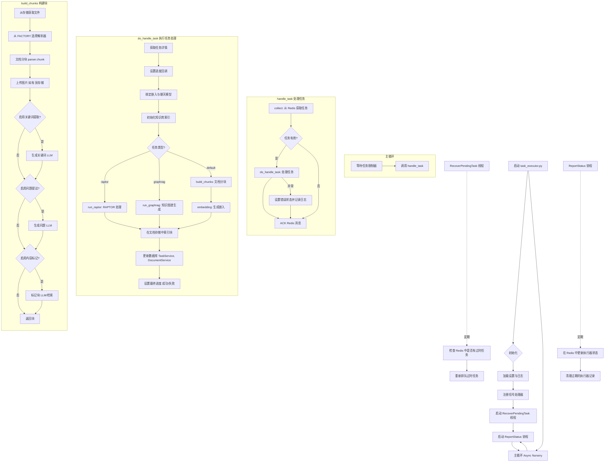

# ai-papers
收集AI领域论文，如果是PDF转换为Markdown格式，如果是英文转换为中文方式。PDF转换中涉及数学公式可能存在错误，需要参照原始PDF对应查看

```mermaid
graph TD
    A[启动 task_executor.py] --> B{初始化};
    B --> C[加载设置与日志];
    C --> D[注册信号处理器];
    D --> E[启动 RecoverPendingTask 线程];
    E --> F[启动 ReportStatus 协程];
    F --> G[主循环 Async Nursery];

    subgraph 主循环
        direction LR
        G1[等待任务限制器] --> H[调用 handle_task];
    end

    subgraph handle_task 处理任务
        direction TB
        H1[collect: 从 Redis 获取任务] --> H2{任务有效?};
        H2 -- 是 --> H3[do_handle_task: 处理任务];
        H3 --> H4[ACK Redis 消息];
        H2 -- 否 --> H4;
        H3 -- 异常 --> H5[设置错误状态并记录日志];
        H5 --> H4;
    end

    subgraph do_handle_task 执行任务处理
        direction TB
        P1[获取任务详情] --> P2[设置进度回调];
        P2 --> P3[绑定嵌入与聊天模型];
        P3 --> P4[初始化知识库索引];
        P4 --> P5{任务类型?};
        P5 -- raptor --> P6[run_raptor: RAPTOR 处理];
        P5 -- graphrag --> P7[run_graphrag: 知识图谱生成];
        P5 -- default --> P8[build_chunks: 文档分块];
        P8 --> P9[embedding: 生成嵌入];
        P6 --> P10[在文档存储中索引块];
        P7 --> P10;
        P9 --> P10;
        P10 --> P11[更新数据库 TaskService, DocumentService];
        P11 --> P12[设置最终进度 成功/失败];
    end

    subgraph build_chunks 构建块
        direction TB
        BC1[从存储获取文件] --> BC2[从 FACTORY 选择解析器];
        BC2 --> BC3[文档分块 parser.chunk];
        BC3 --> BC4[上传图片 如有 到存储];
        BC4 --> BC5{启用关键词提取?};
        BC5 -- 是 --> BC6[生成关键词 LLM];
        BC5 -- 否 --> BC7;
        BC6 --> BC7{启用问题提议?};
        BC7 -- 是 --> BC8[生成问题 LLM];
        BC7 -- 否 --> BC9;
        BC8 --> BC9{启用内容标记?};
        BC9 -- 是 --> BC10[标记块 LLM/检索];
        BC9 -- 否 --> BC11[返回块];
        BC10 --> BC11;
    end

    G --> F;

    R[RecoverPendingTask 线程] -. 定期 .-> R1[检查 Redis 中是否有过时任务];
    R1 --> R2[重新排队过时任务];

    S[ReportStatus 协程] -. 定期 .-> S1[在 Redis 中更新执行器状态];
    S1 --> S2[清理过期的执行器记录];

    A --> G;

```
